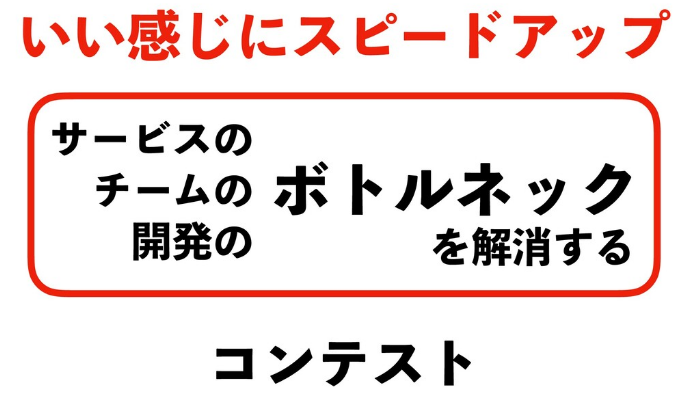

# ISUCON 基礎知識
## 競技の進み方
TODO 本番の競技時間の画像を張る

## 推測するな、計測せよ
**「合理的な根拠なしに決めつけて最適化を行う」のではなく、  
「計測して得られた結果を元にボトルネックを分析し、改善方針を決めよ」** ということです。

「推測するな、計測せよ」は、サーバーチューニングの基本です。この界隈では非常に有名な格言です。
:::tip ボトルネックを改善すれば一気にスコアが上がる！(ボトルネック以外を治しても全然スコアが上がらない。)
ボトルネックとは、一番時間を費やしている処理の事で、全体の処理速度を大きく遅くしている箇所のことです。  
ボトルネック以外を治しても、ほとんどの処理時間はボトルネックに使われるので、全然スコアが上がりません。  
逆に言えば、ボトルネックを改善すれば一気にスコアが上がります！ボトルネックの見定めを間違えるとせっかく改善しても無駄になってしまうので、推測するのではなくしっかりと計測し、ボトルネックを見定めましょう！「推測するな、計測せよ」
:::
:::tip ISUCONは「計測し、ボトルネックを見つけ、改善する」というサイクルが非常に重要！
上の tip で解説したように、ボトルネックを改善し続けることがスコアを上げるための一番の手法です。  
つまり、「計測->ボトルネックの発見->改善->計測->ボトルネックの発見->改善……」 このループが基本です！  
このループをいかに上手く回せるかが、ISUCONでのスコアの差、実力の差となります。
:::
<b style="font-size: 150%;">つまり、ISUCONはボトルネックを改善し続けていくコンテストなのです！</b>

