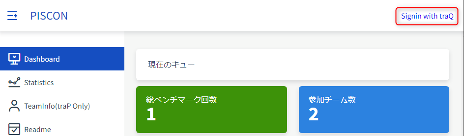
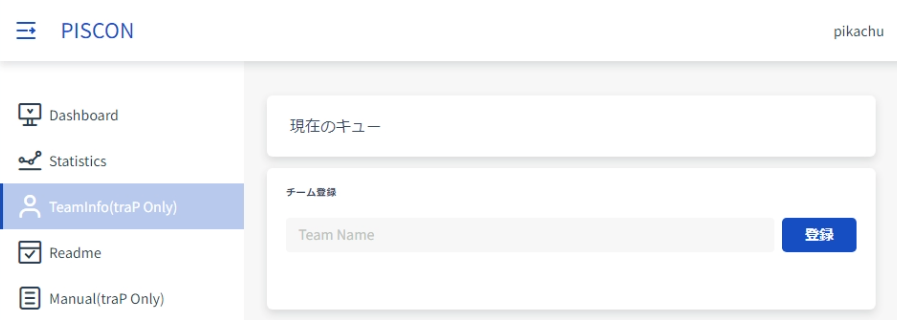
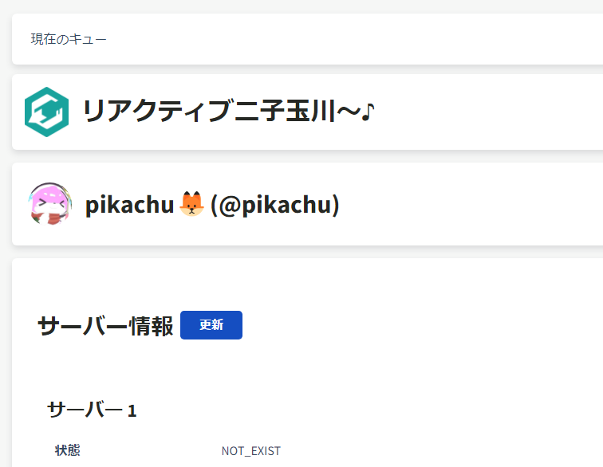
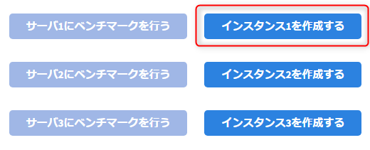
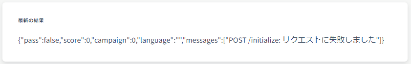

# ポータルの使い方を知ろう

以下、PISCON(部内ISUCON)開催時かつISUCON9予選の問題を使って説明します。

## ログイン
[PISCON Portal](https://piscon.trap.jp) を開き、右上にある`Signin with traQ`からログインしてください。  


## チームの作成
ログインしたら、サイドバーから[`TeamInfo`](https://piscon.trap.jp/team)を開き、自分のチーム名を入力して作成してください。

:::warning WARNING チーム名は間違えないように！
チーム名は1文字でも違うと別のチームとして認識されます！絶対に間違えないように、コピペ推奨です！  
万が一間違えてしまった場合は #event/workshop/piscon/sodan に @pikachu をつけて連絡してください。
:::
:::tip 既にあるチームに入る場合
同じチーム名を入力して作成すると、同じチームに入れます。サーバーも共有になります。
:::

## インスタンスの作成
チームを作成したら、[以下の画面](https://piscon.trap.jp/team)になると思います。

下にスクロールして、インスタンスを作成してください。簡単に言うとサーバーの作成です。  
立ち上がるまで1~2分かかります。

:::warning
とりあえず最初は1台だけ建てましょう。このPISCONの開催にあたって、サーバー代の予算がなんと10万円かかっています。  
サーバー代の節約にご協力ください。複数人チームの場合は1人1台建ててもらって大丈夫です。
:::

## 初期状態でのベンチマークの実行
インスタンスが立ち上がったら、ベンチマークを回しましょう！

1回のベンチマークにかかる時間は、約1分です。(どのISUCONでも基本的に1分程度だと思います。)  

この1分の間に、ベンチマーカーがチームのサーバーに対して大量のリクエストを送り、凄い負荷をかけ、レスポンスからスコアを算出して返すわけですね。
:::tip ベンチマーカーって何なの？
ベンチマークを行うためのサーバーです。基本的には僕らのサーバーよりも高スペックのサーバーが使われます。  
1分間に大量のリクエストをチームのサーバーに送り、凄い負荷をかけ、レスポンスからスコアを算出して返します。  
スコアを計算する役割を担っている以上、競技の核とも言えます。なので、ベンチマーカーを作る人は、競技がいい感じに成り立つように、めちゃくちゃベンチマーカーの設計を頑張っています。ベンチマーカーの質がそのまま競技の質になりますからね。
:::
:::tip キューについて
「ベンチマークを行う」を押すとキュー(順番待ち)に追加され、順番にベンチマークが実行されていきます。  
PISCON競技中は混んでても4-5チームくらいがキューにいるくらいなので、そこまで待たされることはないです。  
ISUCON本番ではチーム数が莫大なので、各チームに対してベンチマーカーが立てられ、すぐにベンチマークが実行できるようにされているなど、基本的には競技に支障が出ないように工夫がされています。
:::
:::tip 負荷走行は60秒
いわゆる負荷をかけまくる期間は60秒でも、その前後の初期化や整合性チェックに30~60秒かかります。  
実際の負荷走行60秒は固定で、この負荷走行の間にどれだけのリクエストを処理できたかでスコアが決まります。
:::

## ベンチマークの結果を見てみよう

結果を見てみましょう。
```json
{
   "pass":false, // ベンチマークが成功したかどうか
   "score":0, // スコア
   "campaign":0, // TODO
   "language":"", // 使用言語
   "messages":[ // ベンチマークの実行中に出力されたメッセージ
      "POST /initialize: リクエストに失敗しました"
   ]
}
```
どうやら、ベンチマークが成功しなかったようです。この状況をfailしたとか言います。  
`messages`を見ると、`POST /initialize`のリクエストが失敗したためfailしてしまったようです。  
本来であれば、最初から既に正常に動作する状態でサーバーが渡されるのですが、  
今回のPISCONでは諸事情により少し設定をしなければなりません。次の章で一緒に設定をしましょう。
:::info
今回、インスタンスを作成しただけでは、nginxがSSL/TLSを無効な証明書を使って行おうとするため、ベンチマーカーを実行できません。  
それを回避するために`/etc/nginx/sites-available/isucari.conf`を次のように書き換える必要があります。  
[PISCONマニュアルページより](https://piscon.trap.jp/manual)
:::

:::tip ここまでウェブページ上だけで全部できちゃった！
本番でも、サーバーの構築や、ベンチマークの実行などは、このようにウェブページ上ですべてできるようになっています。  
僕たち参加者が、競技に集中するために複雑な部分はこうやって抽象化してくれてるわけですね。ありがたい！
:::
