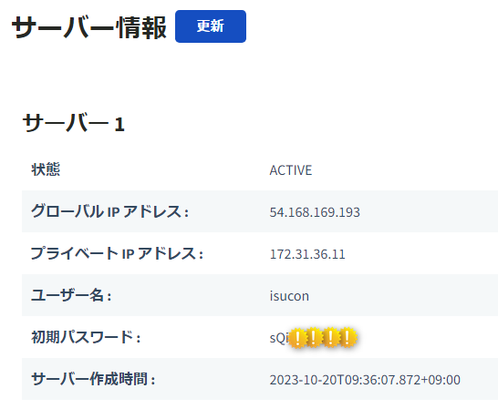
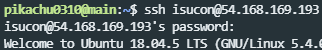
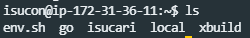

# サーバーに入る設定をしよう

## サーバーに入る
[チーム画面](https://piscon.trap.jp/team)に行くと、サーバー情報があると思います。

ターミナルを開いて、`ssh`コマンドを使ってサーバーに入ってみましょう。
```shell
ssh ユーザーネーム@グローバルIPアドレス
```
上記のコマンドでサーバーに接続できます。  
例えば、サーバー情報に`グローバルIPアドレス: 54.168.169.193`と書いてあったら、
```shell
ssh isucon@54.168.169.193
```
と入力することでサーバーに接続できます。サーバーに接続すると、パスワードを求められるので、サーバー情報に書いてあるパスワードをコピペで入力しましょう。

以下の様にユーザーネームが`isucon`になり、サーバーに入れたと思います。  

サーバーから抜けるには、`exit`コマンドを使います。

:::tip 秘密鍵と公開鍵の作り方
以下の「パスワードを入力しなくても接続できるようにする」と「`ssh isucon9`で接続できるようにする」には、秘密鍵と公開鍵が必要です。必須では無いのですが、凄く楽になるのでやりましょう。  
秘密鍵と公開鍵を作成するには、`ssh-keygen`コマンドを使います。以下のコマンドを実行することで、秘密鍵と公開鍵が作成されます。以下のコマンドは、自分のPC上で実行してください。
```shell
mkdir ~/.ssh && chmod 744 ~/.ssh/ && cd ~/.ssh # ~/.ssh というディレクトリを作成
ssh-keygen -t ed25519 # 入力を複数回求められるが、全部何も入力せずにEnterで良い
ls && cat id_ed25519.pub
```
`id_ed25519`が秘密鍵、`id_ed25519.pub`が公開鍵です。  
**秘密鍵は絶対に公開しないようにしましょう。** 公開鍵は公開しても大丈夫です。
:::
:::tip パスワードを入力しなくても接続できるようにする(ちょっと発展)
接続する際に、毎回パスワードを入力するのは面倒ですよね。実際ISUCONでは何度もサーバーに入ることが多いです。  
そこで、公開鍵認証を使って、パスワードを入力しなくても接続できるようにしましょう。
サーバーは`.ssh/authorized_keys`にある公開鍵に対応する秘密鍵を持っているユーザーに、接続を許可します。一般的に、サーバーに接続をする際は、ほとんどがこの公開鍵認証です。  
ここでは、例として@pikachuの公開鍵`ssh-ed25519 AAAAC(省略)K+poi`を追加してみます。
以下のコマンドはサーバーで実行してください。
```shell
cd ~ && mkdir .ssh
echo "ssh-ed25519 AAAAC3NzaC1lZDI1NTE5AAAAIO3aFsxQ60hI/ZFy5vJ+N6C0ONFBkfoQXz2PuTMK+poi" >> .ssh/authorized_keys
```
これで、`ssh isucon@xx.xxx.xxx.xxx`でパスワードを入力せずに接続できるようになりました。
:::
:::tip `ssh isucon9`で接続できるようにする(ちょっと発展)
いちいち`isucon@xx.xxx.xxx.xxx`と入力するのもめんどくさいですよね。  
なので、`ssh isucon9`で接続できるようにしようと思います。  
`~/.ssh`に、`config`というファイルを作成し、そのファイルに以下をテキストとして追加します。
```shell
Host isucon9
  HostName xx.xxx.xxx.xxx # ここにグローバルIPアドレスを書く
  IdentityFile ~/.ssh/id_ed25519 # ここに秘密鍵のパスを書く
  User isucon # ここにユーザーネームを書く
```
これで、`ssh isucon9`ですぐに接続できるようになりました！
:::details パっとファイルにテキストとして追加するコマンド
```shell
cat >> ~/.ssh/config <<EOL

Host isucon9
  HostName xx.xxx.xxx.xxx
  IdentityFile ~/.ssh/id_ed25519
  User isucon
EOL
```
:::
