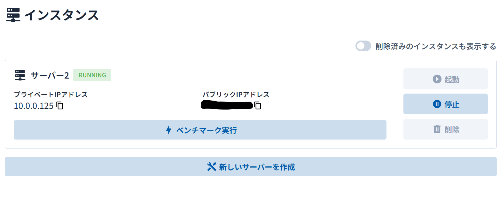
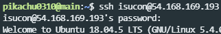
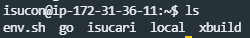

# サーバーに入る設定をしよう

## サーバーに入る
[インスタンス画面](https://piscon.trap.jp/instances)に行くと、サーバー情報があると思います。

ターミナルを開いて、`ssh`コマンドを使ってサーバーに入ってみましょう。
```shell
ssh isucon@パブリックIPアドレス
```
上記のコマンドでサーバーに接続できます。  
例えば、サーバー情報に`パブリックIPアドレス: 203.0.113.0`と書いてあったら、
```shell
ssh isucon@203.0.113.0
```
と入力することでサーバーに接続できます。`isucon` の部分はユーザー名です。ISUCON のときは `isucon` ユーザーが用意されていることが多いです。当日はマニュアルを読んで確認しましょう。

以下の様にユーザーネームが`isucon`になり、サーバーに入れたと思います。  

サーバーから抜けるには、`exit`コマンドを使います。

:::tip SSH での公開鍵認証(ちょっと発展)
SSH を行う際に、今回はパスワードではなく公開鍵認証を用いました。公開鍵認証とは、公開鍵と秘密鍵の 2 種類の鍵を用いて行う認証のことです。
サーバー側に公開鍵を配置し、手元にある秘密鍵を使って接続します。それでは、公開鍵はサーバーのどこに配置されているのでしょうか。

サーバーは`.ssh/authorized_keys`にある公開鍵に対応する秘密鍵を持っているユーザーに、接続を許可します。一般的に、サーバーに接続をする際は、ほとんどがこの公開鍵認証です。  
ここでは、例として@pikachuの公開鍵`ssh-ed25519 AAAAC(省略)K+poi`を追加してみます。自分で実行するときは、自分の公開鍵に置き換えてください。  
以下のコマンドはサーバーで実行してください。
```shell
cd ~ && mkdir ~/.ssh && chmod 744 ~/.ssh
echo "ssh-ed25519 AAAAC3NzaC1lZDI1NTE5AAAAIO3aFsxQ60hI/ZFy5vJ+N6C0ONFBkfoQXz2PuTMK+poi" >> .ssh/authorized_keys
```
これで、`ssh isucon@{パブリックIPアドレス}`でパスワードを入力せずに接続できるようになりました。
PISCON ではポータルがインスタンスを起動するときに自動的に公開鍵を GitHub から取得して`~/.ssh/authorized_keys`に配置しています。本物の ISUCON でも事前に GitHub ID を共有しておき、自動で鍵が登録されていることが多いですが、自分でやる必要がある場合にも慌てずできるように、この仕組みを知っておきましょう。
:::
:::tip `ssh isucon1`で接続できるようにする(ちょっと発展)
いちいち`isucon@{パブリックIPアドレス}`と入力するのもめんどくさいですよね。  
なので、`ssh isucon1`で接続できるようにしようと思います。なぜこの名前かというと、isucon3で3台目のサーバーに接続という風な運用にしたいからです。  
`~/.ssh`に、`config`というファイルを作成し、そのファイルに以下をテキストとして追加します。
```shell
Host isucon1
  HostName {パブリックIPアドレス} # ここにパブリックIPアドレスを書く
  IdentityFile ~/.ssh/id_ed25519 # ここに秘密鍵のパスを書く
  User isucon # ここにユーザーネームを書く
```
これで、`ssh isucon1`ですぐに接続できるようになりました！
:::details パっとファイルにテキストとして追加するコマンド
```shell
cat >> ~/.ssh/config <<EOL

Host isucon1
  HostName {パブリックIPアドレス}
  IdentityFile ~/.ssh/id_ed25519
  User isucon
EOL
```
:::
