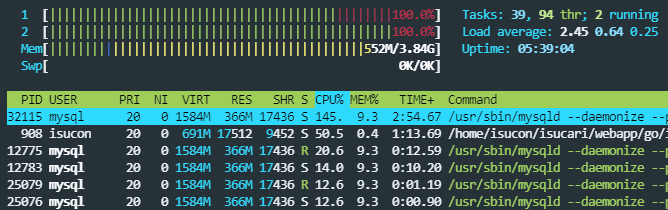

# ベンチマーカーを動して、計測しよう

## ベンチマーカーが動くように、設定をする。
[PISCONマニュアルページ](https://piscon.trap.jp/manual)によると、サーバー内の`/etc/nginx/sites-available/isucondition.conf`ファイルを書き換える必要があります。  
ファイル編集コマンド`nano`や`vim`を使っても良いのですが、あまりここで躓いて欲しくないので、以下のコマンドを用意しました。サーバーに入って、以下のコマンドを実行してください。
```shell
sudo bash -c 'cat <<EOL > /etc/nginx/sites-available/isucondition.conf
server {
    # listen 443 ssl http2;

    # ssl_certificate /etc/nginx/certificates/tls-cert.pem;
    # ssl_certificate_key /etc/nginx/certificates/tls-key.pem;

    location / {
        proxy_set_header Host \$http_host;
        proxy_pass http://127.0.0.1:3000;
    }
}
EOL
'
```
上記のコマンドで設定ファイルを書き換えたら、nginxを再起動して設定を反映させます。
```shell
sudo nginx -t # 先ほど変更したファイルが、正しく読み込めるかチェック
sudo systemctl reload nginx # Nginxの設定を再読み込み
```

また、今回はもう1つ変更しなければならないファイルがあるため、以下のコマンドもサーバー内で実行してください。ただし、`isucondition-1.t.isucon.dev`の数字は、サーバーのN台目の数字に合わせてください！(3台目であれば`isucondition-3.t.isucon.dev`)  
```shell
sudo bash -c 'cat <<EOL > /home/isucon/env.sh 
MYSQL_HOST="127.0.0.1"
MYSQL_PORT=3306
MYSQL_USER=isucon
MYSQL_DBNAME=isucondition
MYSQL_PASS=isucon
POST_ISUCONDITION_TARGET_BASE_URL="http://isucondition-1.t.isucon.dev"
EOL
'
```

上記のコマンドで環境変数を書き換えたら、以下のコマンドでアプリを再起動して反映させます。
```shell
sudo systemctl restart isucondition.go.service # アプリ(isucondition)の再起動
```

これで、ベンチマークが正常に実行できます。

## 初めての計測
改めて、再度ベンチマークを回しましょう！  
ベンチマークを回してる間に、サーバー上で`htop`と入力し実行しましょう。  
`htop`とは、`Ubuntu`にデフォルトで入っている`process viewer`のことです。  

左上に書いてあるのが、CPU使用率です。このサーバーは2コアで、どちらもフルに動いていますね。  
ベンチマークが走っている証です。  
CPUの所をクリックすると、CPU使用率の高い順にプロセスがソートされます。  
画像では、1番上のmysqlプロセスが145%ものCPUを使っていますね。2番目がアプリケーションで50%です。  
明らかにデーターベースがボトルネックとなっていそうだと分かります。  
`htop`は、`exit`コマンドで抜けれます。

## 初めてのスコア
ベンチマークが終わると、スコアが出てきます。
```
15:14:03.477555 ===> PREPARE 
15:14:09.083600 ===> LOAD 
15:14:09.083740 score: 0(0 - 0) : Score 
15:14:09.083748 deduction: 0 / timeout: 0 
15:14:12.084564 score: 1159(1160 - 1) : pass 
15:14:12.084581 deduction: 0 / timeout: 13 
15:14:14.084398 ユーザーは増えませんでした 
15:14:15.084653 score: 1426(1428 - 2) : pass 
15:14:15.084670 deduction: 0 / timeout: 
21 15:14:18.085024 score: 1928(1930 - 2) : pass 
15:14:18.085041 deduction: 0 / timeout: 21 
15:14:19.084970 ユーザーは増えませんでした 

(省略)

ReadCriticalCondition: 187 
15:15:09.087314 score: 9372(9376 - 4) : pass 
15:15:09.087325 deduction: 0 / timeout: 49
```
初期状態でのスコアは9372点でした！ようやくISUCONが始まりましたね！
