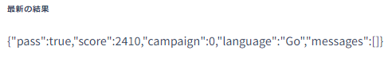

# ベンチマーカーを動して、計測しよう

## ベンチマーカーが動くように、設定をする。
[PISCONマニュアルページ](https://piscon.trap.jp/manual)によると、サーバー内の`/etc/nginx/sites-available/isucari.conf`ファイルを書き換える必要があります。  
ファイル編集コマンド`nano`や`vim`を使っても良いのですが、あまりここで躓いて欲しくないので、以下のコマンドを用意しました。サーバーに入って、以下のコマンドを実行してください。
```shell
sudo bash -c 'cat <<EOL > /etc/nginx/sites-available/isucari.conf
server {
        # listen 443 ssl;
        # server_name isucon9.catatsuy.org;

        # ssl_certificate //etc/nginx/sites-available/isucari.confssl/fullchain.pem;
        # ssl_certificate_key //etc/nginx/sites-available/isucari.confssl/privkey.pem;

        location / {
                        proxy_set_header Host $http_host;
                        proxy_pass http://127.0.0.1:8000;
        }
}
EOL
'
```
上記のコマンドで設定ファイルを書き換えたら、nginxを再起動して設定を反映させます。
```shell
sudo nginx -t # 先ほど変更したファイルが、正しく読み込めるかチェック
sudo systemctl reload nginx # Nginxの設定を再読み込み
```
これで、ベンチマークが正常に実行できます。

## 初めての計測
改めて、再度ベンチマークを回しましょう！  
ベンチマークを回してる間に、サーバー上で`htop`と入力し実行しましょう。  
`htop`とは、`Ubuntu`にデフォルトで入っている`process viewer`のことです。  

左上に書いてあるのが、CPU使用率です。このサーバーは2コアで、どちらもフルに動いていますね。  
ベンチマークが走っている証です。  
CPUの所をクリックすると、CPU使用率の高い順にプロセスがソートされます。  
画像では、1番上のmysqlプロセスが145%ものCPUを使っていますね。2番目がアプリケーションで50%です。  
明らかにデーターベースがボトルネックとなっていそうだと分かります。  
`htop`は、`exit`コマンドで抜けれます。

## 初めてのスコア
ベンチマークが終わると、スコアが出てきます。

```json
{
   "pass":true,
   "score":2410,
   "campaign":0,
   "language":"Go",
   "messages":[]
}
```
初期状態でのスコアは2410点でした！ようやくISUCONが始まりましたね！