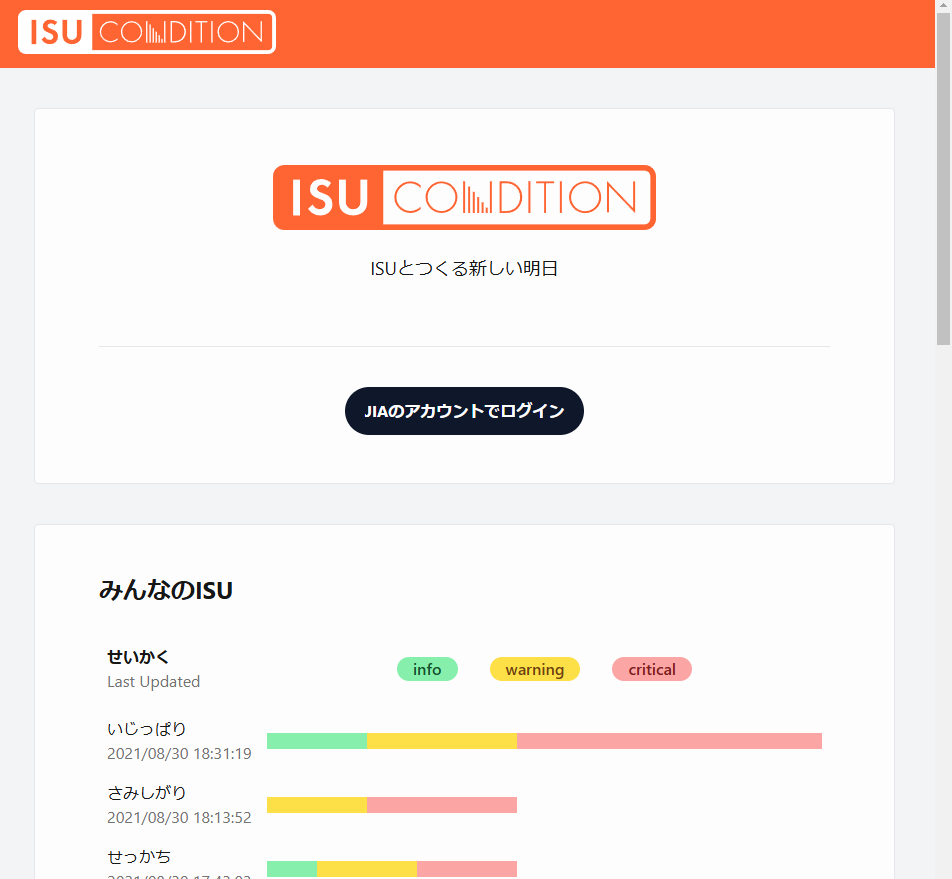

# Web アプリにアクセスしよう

http://54.168.169.193/ のように、設定して動くようにしたウェブアプリケーションはアクセスできます。  
ベンチマークを動かした後、サーバーのグローバルIPアドレスにアクセスして、ふんふんこんな感じかと見てみましょう。  
レスポンスちょっと遅いな～とか、ここキャッシュできそうだな～みたいなことも意識しながら軽く触ると良いです。

:::tip ISUCONは、椅子が舞台になりがち
ISUCON9予選はメルカリが主催だったので、ISU(椅子) × メルカリ で ISUCARI というウェブアプリケーションが問題の舞台となりました。
いつもこんな感じで、椅子を舞台にしたウェブアプリが問題になりがちです。
:::