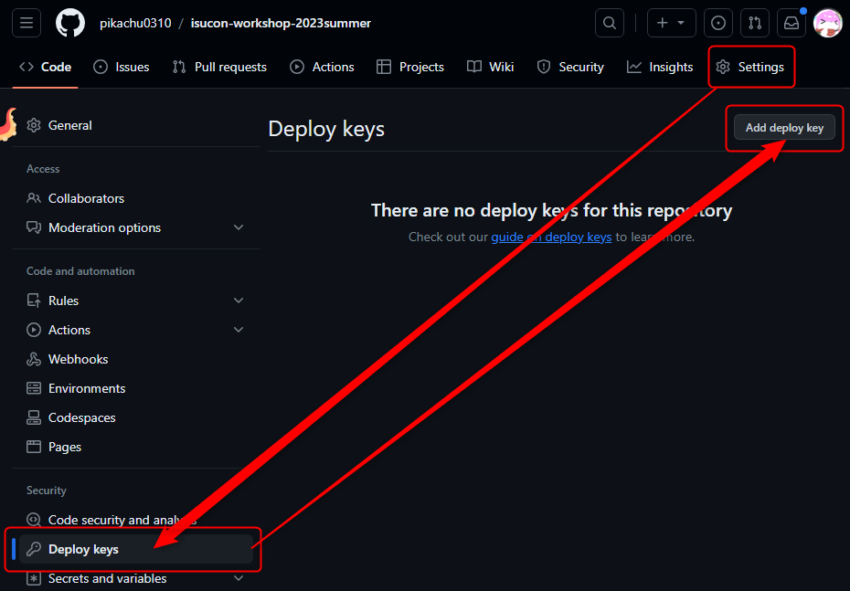
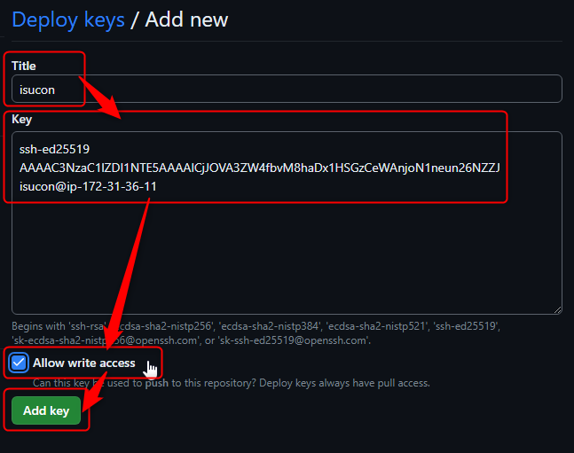
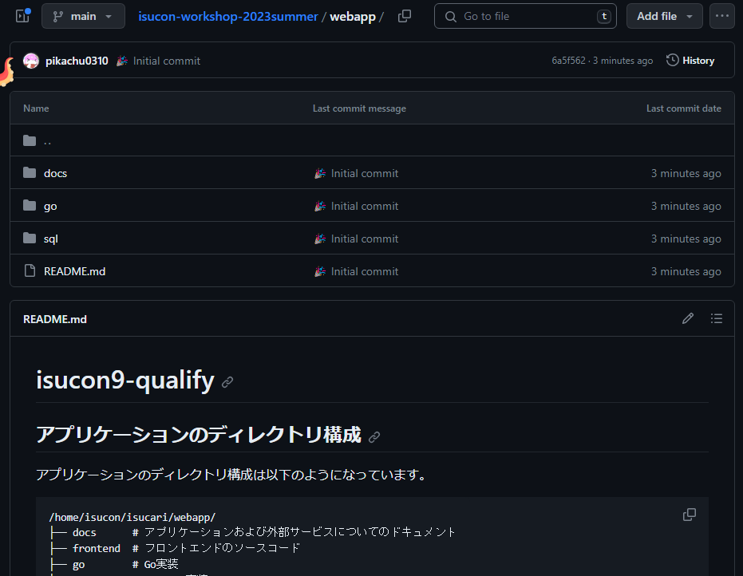
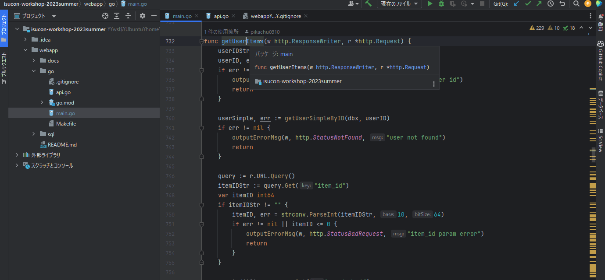

# GitHubを活用する
これから、本格的に計測用のツールを導入して、本格的に計測を行い、改善をし始めます。その上で GitHub は必要不可欠です。

## 改善を簡単に行えるように、GitHub を扱う
サーバー上で操作したり、ファイルを編集するのは、非常に大変です。複数人チームならなおさら混乱します。  
また、間違った操作をしてしまうと、サーバーが壊れてしまい、元に戻せなくて数時間の努力が水の泡になってしまうこともあります。  
なので GitHub 上に、サーバー上のファイルをコピーして、`git`管理を行いましょう。バージョン管理もできるし、手元にファイルを持ってくることもできます。  

## サーバー上に GitHub 用の秘密鍵と公開鍵を作る
サーバーから GitHub にアクセスするために、公開鍵認証を行います。  
サーバー上で以下のコマンドを実行して下さい。
```shell
mkdir ~/.ssh && chmod 744 ~/.ssh/
cd ~/.ssh
ssh-keygen -t ed25519 # 入力を複数回求められるが、全部何も入力せずにEnterで良い
cat id_ed25519.pub

```
これで、秘密鍵と公開鍵ができました。次に以下のコマンドを実行して`config`ファイルに設定を書き込みます。
```shell
cat >> ~/.ssh/config <<EOL
Host github.com
  HostName github.com
  IdentityFile ~/.ssh/id_ed25519
  User git
EOL
```
最後に、以下のコマンドを実行して`config`ファイルの権限を変更します。
```shell
chmod 644 config
sudo chown isucon config
```

## GitHub に公開鍵を登録し、GitHub と公開鍵認証できるようにする
https://github.com/new にアクセスして、新しいリポジトリを作成します。  
今回は練習なのでパブリックでも良いのですが、本番は**必ずプライベートリポジトリ** で作りましょう。
:::danger 
**本番は必ずprivateリポジトリとして作成すること。**

競技中にpublicリポジトリに問題のソースコードをアップしてしまうと、失格になる可能性があります。

> 以下の行為を特に禁止する。
> - 予選の競技終了時間までに、競技の内容に関するあらゆる事項 (問題内容・計測ツールの計測方法など)を公開・共有すること(内容を推察できる発言も含む)
>
> [ISUCON11 予選レギュレーション : ISUCON公式Blog](https://isucon.net/archives/55854734.html)
:::

リポジトリを作成したら、`Settings`から`Deploy keys`を選択し、`Add deploy key`を押します。

Key の欄に、先ほど作成した公開鍵(`cat ~/.ssh/id_ed25519.pub`)を貼り付けます。  
Title は何でも良いです。  
**Allow write access** にチェックを入れて(忘れずに！)`Add key`を押します。


サーバー上で以下のコマンドを実行し、接続できるか確認します。
```shell
ssh -T git@github.com 
```
`Hi pikachu0310/isucon-workshop-2023summer! You've successfully authenticated, but GitHub does not provide shell access.`と帰ってきたら成功です。

## 必要な物を GitHub にアップロードする
### どれをアップロードするかを決める
基本的に`~/isucari/webapp/`にアプリケーションが入っているので、そこを GitHub にアップロードします。  
`~/isucari/webapp/`の中身を見てみましょう。
```shell
cd ~/isucari/webapp/
cat README.md
```
```
アプリケーションのディレクトリ構成は以下のようになっています。

/home/isucon/isucari/webapp/
├── docs      # アプリケーションおよび外部サービスについてのドキュメント
├── frontend  # フロントエンドのソースコード
├── go        # Go実装
├── nodejs    # Node.js実装
├── perl      # Perl実装
├── php       # PHP実装
├── python    # Python実装
├── ruby      # Ruby実装
├── public    # jsやcss、画像データ等の静的ファイル
└── sql       # データベースのスキーマおよび初期化に必要なSQL
```
主に改善に使うのは`go`と`sql`だと思うので、ドキュメントも合わせて`docs`と`go`と`sql`を GitHub にアップロードします。  

### .gitignore に追加する。
注意点として、でかいファイルがあれば、`.gitignore`に追加しましょう。まずは`go`の中身を確認します。  
```shell
cd ~/isucari/webapp/go
ls -la
```
```
isucon@ip-172-31-36-11:~/isucari/webapp/go$ ls -la
total 12220
drwxr-xr-x  2 isucon isucon     4096 Oct 20 12:47 .
drwxr-xr-x 12 isucon isucon     4096 Apr 29  2021 ..
-rw-r--r--  1 isucon isucon       72 Apr 29  2021 Makefile
-rw-r--r--  1 isucon isucon     4689 Apr 29  2021 api.go
-rw-r--r--  1 isucon isucon      265 Apr 29  2021 go.mod
-rw-r--r--  1 isucon isucon     1844 Apr 29  2021 go.sum
-rwxr-xr-x  1 isucon isucon 12420019 Apr 29  2021 isucari
-rw-r--r--  1 isucon isucon    60810 Oct 20 12:47 main.go
```
`isucari`というファイルがバイナリファイルで`12420019`と容量がでかいので、`.gitignore`に追加します。
```shell
cd ~/isucari/webapp/go
echo "isucari" >> .gitignore
```
同様に`sql`の中身を確認すると、`initial.sql`が大きいので、`.gitignore`に追加します。
```shell
cd ~/isucari/webapp/sql
ls -la
echo "initial.sql" >> .gitignore
```
同様に`docs`の中身を確認すると、`images`がちょっと大きいですが、`.gitignore`に追加するほどではないので、そのまま GitHub にアップロードします。
```shell
cd ~/isucari/webapp/docs
ls -la
```

### GitHub にアップロードする
まずは、自分のGitHubのアカウントでGitHubにコミットするために、以下の設定しましょう。(自分のメアドと名前に置き換えて)
```shell
git config --global user.email "pikachu13711@gmail.com"
git config --global user.name "pikachu0310"
```
次に、`~/isucari`に戻って、以下のコマンドを実行し、GitHubにアップロードします。  
以下のコマンドを順番に実行します。  
ただし、7行目の`git@github.com:pikachu0310/isucon-workshop-2023summer.git`を自分のリポジトリに置き換えてください。
```shell
cd ~/isucari
git init
git add webapp/README.md webapp/go webapp/sql webapp/docs
git status # 確認
git commit -m ":tada: Initial commit"
git branch -M main
git remote add origin git@github.com:pikachu0310/isucon-workshop-2023summer.git
git push -u origin main
```
これで、GitHub にアップロードできました！自分のレポジトリにアクセスして、確認してみましょう。


## GitHub から手元にファイルを持ってくる
GitHub にアップロードしたファイルを手元に持ってきます。  
分かる人は好きなところにクローンしてください。  
以下のコマンドは、自分のPC上で実行してください。  
```shell
mkdir github
cd github
git clone 自分のレポジトリURL
```
これで、サーバー上のファイルが手元に来ました！  
これからは、手元でファイルを編集してGitHubにPushし、サーバー上でPullすることで、手元のファイルの変更をサーバー上に反映させます。
試しに`webapp/READ.md`にちょっと変更を加えてサーバーに反映してみましょう。  
これからは贅沢にもテキストエディタが使えるので、好きなテキストエディタで`webapp/READ.md`の要らない言語部分を消しましょう。以下のようになります。
```markdown
/home/isucon/isucari/webapp/
├── docs      # アプリケーションおよび外部サービスについてのドキュメント
├── frontend  # フロントエンドのソースコード
├── go        # Go実装
├── public    # jsやcss、画像データ等の静的ファイル
└── sql       # データベースのスキーマおよび初期化に必要なSQL
```
変更したら、GitHubにPushしましょう。(自分のPC上で実行)
```shell
cd <クローンしたディレクトリ>
git add webapp/README.md
git commit -m ":memo: README.mdの要らない言語部分を消した"
git push
```
GitHub上の変更をサーバーに反映させる。(サーバー上で実行)
```shell
cd ~/isucari && git pull
cat webapp/README.md
```
以下の様に、サーバー上に反映できています！
```
/home/isucon/isucari/webapp/
├── docs      # アプリケーションおよび外部サービスについてのドキュメント
├── frontend  # フロントエンドのソースコード
├── go        # Go実装
├── public    # jsやcss、画像データ等の静的ファイル
└── sql       # データベースのスキーマおよび初期化に必要なSQL
```
これで`webapp/go/main.go`や`webapp/sql/01_schema.sql`ファイルをわざわざサーバー上で編集する必要が無くなり、ローカルでコーディングできるようになりました！

