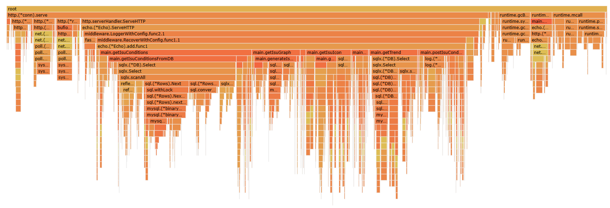
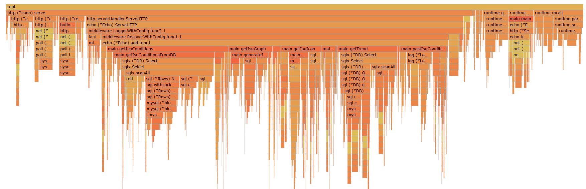
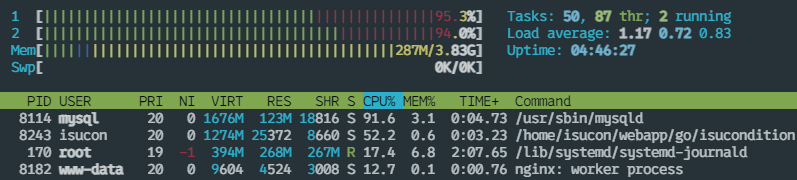

# 計測、ボトルネックの発見、改善！

ここで扱う内容は、https://github.com/pikachu0310/PISCON2024-workshop/commits/main/ で実践しているためこちらも参照してください。

## 計測
まずは今までの情報をまとめましょう。

ベンチマークを回す前にログローテーション&再起動
```shell
sudo rm /var/log/mysql/mariadb-slow.log
sudo systemctl restart mysql

sudo rm /var/log/nginx/access.log
sudo systemctl restart nginx

cd ~/webapp/go
go build -o isucondition main.go
sudo systemctl restart isucondition.go.service
```

ベンチマーク後(中)の各種計測コマンド
```shell
sudo pt-query-digest /var/log/mysql/mariadb-slow.log > ~/log/$(date +mysql-slow.log-%m-%d-%H-%M -d "+9 hours")
cd ~/log && cat $(ls -t mysql-slow.log-* | head -n 1)

sudo cat /var/log/nginx/access.log | alp ltsv -m"/api/isu/[a-f0-9\-]+","/api/isu/[a-f0-9\-]+/icon","/api/condition/[a-f0-9\-]+","/isu/[a-f0-9\-]+","/isu/[a-f0-9\-]+/graph","/isu/[a-f0-9\-]+/condition","/assets.*" --sort sum -r > ~/log/$(date +access.log-%m-%d-%H-%M -d "+9 hours")
cd ~/log && cat $(ls -t access.log-* | head -n 1)

go tool pprof http://localhost:6060/debug/pprof/profile?seconds=60
go tool pprof -http=localhost:6070 "$(ls -v /home/isucon/pprof/pprof.isucondition.samples.cpu.*.pb.gz | tail -n 1)"
```

複合INDEXを張る改善をした後の計測結果
:::details スロークエリログ全文
```
# 37.1s user time, 160ms system time, 36.27M rss, 43.52M vsz
# Current date: Sat Nov 16 18:09:29 2024
# Hostname: ip-192-168-0-12
# Files: /var/log/mysql/mariadb-slow.log
# Overall: 437.77k total, 96 unique, 4.56k QPS, 1.40x concurrency ________
# Time range: 2024-11-16 17:58:03 to 17:59:39
# Attribute          total     min     max     avg     95%  stddev  median
# ============     ======= ======= ======= ======= ======= ======= =======
# Exec time           134s       0   208ms   307us     1ms     1ms    19us
# Lock time             3s       0    23ms     6us    13us   108us       0
# Rows sent          7.56M       0   1.58k   18.12    3.89  118.99       0
# Rows examine       7.45M       0   1.58k   17.85    0.99  118.15       0
# Rows affecte      72.13k       0     618    0.17    0.99    0.97       0
# Bytes sent         1.89G       0 263.86k   4.53k  16.75k  22.15k   12.54
# Query size        35.49M       6 790.36k   85.01  258.32   1.28k   31.70
# Boolean:
# QC hit         8% yes,  91% no

# Profile
# Rank Query ID                            Response time Calls  R/Call V/M
# ==== =================================== ============= ====== ====== ===
#    1 0x931A992E852C61FC6D46141A39DEF4FE  44.3574 33.0%  15928 0.0028  0.01 SELECT isu_condition     
#    2 0xFFFCA4D67EA0A788813031B8BBC3B329  39.4337 29.3%   9213 0.0043  0.00 COMMIT
#    3 0xB8B32624C3268C0925657C305C0ED778  14.8722 11.1%  73074 0.0002  0.00 INSERT isu_condition     
#    4 0x9C6C682008AE0D08F3E2A0049B030C70  14.1167 10.5%   3253 0.0043  0.01 SELECT isu_condition     
#    5 0xDA556F9115773A1A99AA0165670CE848  12.1349  9.0% 139535 0.0001  0.00 ADMIN PREPARE
#    6 0x5F580A12ADA1633C9634298BE5BD9422   2.8154  2.1%    864 0.0033  0.00 SELECT isu_condition     
#    7 0x8155B89FFD74A9D523D19AC409FD97AF   1.7196  1.3%   5672 0.0003  0.00 SELECT isu_condition     
# MISC 0xMISC                               5.0350  3.7% 190227 0.0000   0.0 <89 ITEMS>

# Query 1: 261.11 QPS, 0.73x concurrency, ID 0x931A992E852C61FC6D46141A39DEF4FE at byte 118952938     
# Scores: V/M = 0.01
# Time range: 2024-11-16 17:58:38 to 17:59:39
# Attribute    pct   total     min     max     avg     95%  stddev  median
# ============ === ======= ======= ======= ======= ======= ======= =======
# Count          3   15928
# Exec time     32     44s     6us    48ms     3ms    11ms     4ms     1ms
# Lock time     18   496ms       0    10ms    31us    28us   251us     7us
# Rows sent     67   5.09M       0   1.58k  335.35   1.20k  402.48  124.25
# Rows examine  67   5.02M       0   1.58k  330.74   1.14k  398.99  118.34
# Rows affecte   0       0       0       0       0       0       0       0
# Bytes sent    40 783.86M     589 263.86k  50.39k 182.98k  60.22k  18.47k
# Query size     4   1.75M     115     115     115     115       0     115
# Boolean:
# QC hit         1% yes,  98% no
# String:
# Databases    isucondition
# Hosts        localhost
# Users        isucon
# Query_time distribution
#   1us  #
#  10us  ###########
# 100us  ####################################################
#   1ms  ################################################################
#  10ms  ########
# 100ms
#    1s
#  10s+
# Tables
#    SHOW TABLE STATUS FROM `isucondition` LIKE 'isu_condition'\G
#    SHOW CREATE TABLE `isucondition`.`isu_condition`\G
# EXPLAIN /*!50100 PARTITIONS*/
SELECT * FROM `isu_condition` WHERE `jia_isu_uuid` = 'c6f1db09-ee79-409c-9e6c-b055564cf7c4' ORDER BY timestamp DESC\G

# Query 2: 151.03 QPS, 0.65x concurrency, ID 0xFFFCA4D67EA0A788813031B8BBC3B329 at byte 81492095      
# Scores: V/M = 0.00
# Time range: 2024-11-16 17:58:38 to 17:59:39
# Attribute    pct   total     min     max     avg     95%  stddev  median
# ============ === ======= ======= ======= ======= ======= ======= =======
# Count          2    9213
# Exec time     29     39s     2us   208ms     4ms    10ms     4ms     4ms
# Lock time      0       0       0       0       0       0       0       0
# Rows sent      0       0       0       0       0       0       0       0
# Rows examine   0       0       0       0       0       0       0       0
# Rows affecte   0       0       0       0       0       0       0       0
# Bytes sent     0  98.97k      11      11      11      11       0      11
# Query size     0  53.98k       6       6       6       6       0       6
# String:
# Databases    isucondition
# Hosts        localhost
# Users        isucon
# Query_time distribution
#   1us  #######
#  10us  ####
# 100us  ###
#   1ms  ################################################################
#  10ms  ####
# 100ms  #
#    1s
#  10s+
COMMIT\G

# Query 3: 1.22k QPS, 0.25x concurrency, ID 0xB8B32624C3268C0925657C305C0ED778 at byte 128235531      
# Scores: V/M = 0.00
# Time range: 2024-11-16 17:58:39 to 17:59:39
# Attribute    pct   total     min     max     avg     95%  stddev  median
# ============ === ======= ======= ======= ======= ======= ======= =======
# Count         16   73074
# Exec time     11     15s    13us    24ms   203us   761us   823us    38us
# Lock time     64      2s     3us    14ms    23us    28us   179us     8us
# Rows sent      0       0       0       0       0       0       0       0
# Rows examine   0       0       0       0       0       0       0       0
# Rows affecte  98  71.36k       1       1       1       1       0       1
# Bytes sent     0 935.66k      13      14   13.11   13.83    0.40   12.54
# Query size    50  17.80M     233     302  255.36  271.23   12.29  246.02
# String:
# Databases    isucondition
# Hosts        localhost
# Users        isucon
# Query_time distribution
#   1us
#  10us  ################################################################
# 100us  #######
#   1ms  ###
#  10ms  #
# 100ms
#    1s
#  10s+
# Tables
#    SHOW TABLE STATUS FROM `isucondition` LIKE 'isu_condition'\G
#    SHOW CREATE TABLE `isucondition`.`isu_condition`\G
INSERT INTO `isu_condition`     (`jia_isu_uuid`, `timestamp`, `is_sitting`, `condition`, `message`)  VALUES ('e4c57c95-dd23-4fa0-bb80-4637baac2bf0', '2021-08-28 01:21:29', 1, 'is_dirty=true,is_overweight=false,is_broken=false', 'キレイにして...')\G

# Query 4: 53.33 QPS, 0.23x concurrency, ID 0x9C6C682008AE0D08F3E2A0049B030C70 at byte 122378320      
# Scores: V/M = 0.01
# Time range: 2024-11-16 17:58:38 to 17:59:39
# Attribute    pct   total     min     max     avg     95%  stddev  median
# ============ === ======= ======= ======= ======= ======= ======= =======
# Count          0    3253
# Exec time     10     14s    51us    52ms     4ms    14ms     5ms     3ms
# Lock time      4   117ms     5us    23ms    36us    36us   459us     8us
# Rows sent     24   1.83M       0   1.53k  589.36   1.14k  362.13  537.02
# Rows examine  24   1.83M       0   1.53k  589.36   1.14k  362.13  537.02
# Rows affecte   0       0       0       0       0       0       0       0
# Bytes sent    14 279.61M     589 261.21k  88.02k 182.98k  54.32k  79.83k
# Query size     1 498.75k     157     157     157     157       0     157
# String:
# Databases    isucondition
# Hosts        localhost
# Users        isucon
# Query_time distribution
#   1us
#  10us  #
# 100us  ################
#   1ms  ################################################################
#  10ms  ##########
# 100ms
#    1s
#  10s+
# Tables
#    SHOW TABLE STATUS FROM `isucondition` LIKE 'isu_condition'\G
#    SHOW CREATE TABLE `isucondition`.`isu_condition`\G
# EXPLAIN /*!50100 PARTITIONS*/
SELECT * FROM `isu_condition` WHERE `jia_isu_uuid` = '06800476-b2e0-4649-b844-bddec542b763'     AND `timestamp` < '2021-08-22 22:36:11'       ORDER BY `timestamp` DESC\G

# Query 5: 2.11k QPS, 0.18x concurrency, ID 0xDA556F9115773A1A99AA0165670CE848 at byte 137925503      
# Scores: V/M = 0.00
# Time range: 2024-11-16 17:58:33 to 17:59:39
# Attribute    pct   total     min     max     avg     95%  stddev  median
# ============ === ======= ======= ======= ======= ======= ======= =======
# Count         31  139535
# Exec time      9     12s    10us    50ms    86us   236us   404us    28us
# Lock time      0       0       0       0       0       0       0       0
# Rows sent      0       0       0       0       0       0       0       0
# Rows examine   0       0       0       0       0       0       0       0
# Rows affecte   0       0       0       0       0       0       0       0
# Bytes sent     1  34.01M      52     681  255.61  621.67  200.20  158.58
# Query size    11   3.99M      30      30      30      30       0      30
# String:
# Databases    isucondition
# Hosts        localhost
# Users        isucon
# Query_time distribution
#   1us
#  10us  ################################################################
# 100us  #####
#   1ms  #
#  10ms  #
# 100ms
#    1s
#  10s+
administrator command: Prepare\G

# Query 6: 14.40 QPS, 0.05x concurrency, ID 0x5F580A12ADA1633C9634298BE5BD9422 at byte 131367119      
# Scores: V/M = 0.00
# Time range: 2024-11-16 17:58:38 to 17:59:38
# Attribute    pct   total     min     max     avg     95%  stddev  median
# ============ === ======= ======= ======= ======= ======= ======= =======
# Count          0     864
# Exec time      2      3s     9us    36ms     3ms    10ms     4ms     2ms
# Lock time      1    46ms       0    11ms    53us    28us   514us     7us
# Rows sent      7 590.17k       6   1.54k  699.46   1.33k  408.09  652.75
# Rows examine   7 588.58k       0   1.54k  697.57   1.33k  409.18  652.75
# Rows affecte   0       0       0       0       0       0       0       0
# Bytes sent     4  88.35M   1.48k 261.21k 104.71k 201.74k  61.16k 101.89k
# Query size     0  97.88k     116     116     116     116       0     116
# Boolean:
# QC hit         0% yes,  99% no
# String:
# Databases    isucondition
# Hosts        localhost
# Users        isucon
# Query_time distribution
#   1us  #
#  10us  #
# 100us  ####################
#   1ms  ################################################################
#  10ms  #####
# 100ms
#    1s
#  10s+
# Tables
#    SHOW TABLE STATUS FROM `isucondition` LIKE 'isu_condition'\G
#    SHOW CREATE TABLE `isucondition`.`isu_condition`\G
# EXPLAIN /*!50100 PARTITIONS*/
SELECT * FROM `isu_condition` WHERE `jia_isu_uuid` = '299d8a9b-ae82-4789-9fae-3266542d8160' ORDER BY `timestamp` ASC\G

# Query 7: 94.53 QPS, 0.03x concurrency, ID 0x8155B89FFD74A9D523D19AC409FD97AF at byte 117574013      
# Scores: V/M = 0.00
# Time range: 2024-11-16 17:58:38 to 17:59:38
# Attribute    pct   total     min     max     avg     95%  stddev  median
# ============ === ======= ======= ======= ======= ======= ======= =======
# Count          1    5672
# Exec time      1      2s    34us    17ms   303us     1ms   857us    76us
# Lock time      5   156ms     3us     9ms    27us    26us   220us     7us
# Rows sent      0   5.47k       0       1    0.99    0.99    0.11    0.99
# Rows examine   0   5.47k       0       1    0.99    0.99    0.11    0.99
# Rows affecte   0       0       0       0       0       0       0       0
# Bytes sent     0   4.00M     589     789  739.71  755.64   21.01  719.66
# Query size     1 692.38k     125     125     125     125       0     125
# String:
# Databases    isucondition
# Hosts        localhost
# Users        isucon
# Query_time distribution
#   1us
#  10us  ################################################################
# 100us  #########################
#   1ms  ######
#  10ms  #
# 100ms
#    1s
#  10s+
# Tables
#    SHOW TABLE STATUS FROM `isucondition` LIKE 'isu_condition'\G
#    SHOW CREATE TABLE `isucondition`.`isu_condition`\G
# EXPLAIN /*!50100 PARTITIONS*/
SELECT * FROM `isu_condition` WHERE `jia_isu_uuid` = '053a8991-b0f2-4c23-8336-025b349be9e5' ORDER BY `timestamp` DESC LIMIT 1\G
```
:::
```
# Profile
# Rank Query ID                            Response time Calls  R/Call V/M
# ==== =================================== ============= ====== ====== ===
#    1 0x931A992E852C61FC6D46141A39DEF4FE  44.3574 33.0%  15928 0.0028  0.01 SELECT isu_condition     
#    2 0xFFFCA4D67EA0A788813031B8BBC3B329  39.4337 29.3%   9213 0.0043  0.00 COMMIT
#    3 0xB8B32624C3268C0925657C305C0ED778  14.8722 11.1%  73074 0.0002  0.00 INSERT isu_condition     
#    4 0x9C6C682008AE0D08F3E2A0049B030C70  14.1167 10.5%   3253 0.0043  0.01 SELECT isu_condition     
#    5 0xDA556F9115773A1A99AA0165670CE848  12.1349  9.0% 139535 0.0001  0.00 ADMIN PREPARE
#    6 0x5F580A12ADA1633C9634298BE5BD9422   2.8154  2.1%    864 0.0033  0.00 SELECT isu_condition     
#    7 0x8155B89FFD74A9D523D19AC409FD97AF   1.7196  1.3%   5672 0.0003  0.00 SELECT isu_condition     
# MISC 0xMISC                               5.0350  3.7% 190227 0.0000   0.0 <89 ITEMS>
```

```
+-------+-----+-------+-----+-----+-----+--------+----------------------------+-------+-------+---------+-------+-------+-------+-------+--------+-----------+------------+---------------+-----------+
| COUNT | 1XX |  2XX  | 3XX | 4XX | 5XX | METHOD |            URI             |  MIN  |  MAX  |   SUM   |  AVG  |  P90  |  P95  |  P99  | STDDEV | MIN(BODY) | MAX(BODY)  |   SUM(BODY)   | AVG(BODY) |
+-------+-----+-------+-----+-----+-----+--------+----------------------------+-------+-------+---------+-------+-------+-------+-------+--------+-----------+------------+---------------+-----------+
| 74401 | 0   | 73763 | 0   | 638 | 0   | POST   | /api/condition/[a-f0-9\-]+ | 0.012 | 0.260 | 550.121 | 0.007 | 0.020 | 0.052 | 0.092 | 0.018  | 0.000     | 14.000     | 84.000        | 0.001     |
| 8988  | 0   | 8371  | 0   | 617 | 0   | GET    | /api/isu/[a-f0-9\-]+       | 0.004 | 0.516 | 303.594 | 0.034 | 0.064 | 0.088 | 0.136 | 0.028  | 0.000     | 135421.000 | 184479057.000 | 20525.040 |
| 207   | 0   | 19    | 0   | 188 | 0   | GET    | /api/trend                 | 0.020 | 1.012 | 197.143 | 0.952 | 1.004 | 1.008 | 1.008 | 0.192  | 0.000     | 8223.000   | 116095.000    | 560.845   |
| 3940  | 0   | 3542  | 0   | 398 | 0   | GET    | /api/condition/[a-f0-9\-]+ | 0.004 | 0.536 | 192.482 | 0.049 | 0.092 | 0.112 | 0.192 | 0.038  | 0.000     | 7142.000   | 20225519.000  | 5133.380  |
| 985   | 0   | 929   | 0   | 56  | 0   | GET    | /api/isu                   | 0.004 | 0.344 | 51.072  | 0.052 | 0.084 | 0.112 | 0.172 | 0.035  | 3.000     | 4637.000   | 2840562.000   | 2883.819  |
| 798   | 0   | 350   | 0   | 448 | 0   | POST   | /api/auth                  | 0.004 | 0.116 | 7.596   | 0.010 | 0.024 | 0.036 | 0.064 | 0.014  | 0.000     | 19.000     | 5152.000      | 6.456     |
| 1710  | 0   | 1230  | 480 | 0   | 0   | GET    | /assets.*                  | 0.000 | 0.216 | 4.080   | 0.002 | 0.004 | 0.008 | 0.012 | 0.006  | 592.000   | 743417.000 | 163241879.000 | 95463.087 |
| 55    | 0   | 51    | 0   | 4   | 0   | POST   | /api/isu                   | 0.004 | 0.124 | 3.832   | 0.070 | 0.092 | 0.120 | 0.124 | 0.024  | 15.000    | 148.000    | 7043.000      | 128.055   |
| 410   | 0   | 182   | 0   | 228 | 0   | GET    | /api/user/me               | 0.056 | 0.084 | 3.256   | 0.008 | 0.020 | 0.032 | 0.064 | 0.013  | 21.000    | 44.000     | 11814.000     | 28.815    |
| 232   | 0   | 174   | 0   | 58  | 0   | POST   | /api/signout               | 0.020 | 0.072 | 2.812   | 0.012 | 0.028 | 0.040 | 0.060 | 0.014  | 0.000     | 21.000     | 1218.000      | 5.250     |
| 451   | 0   | 388   | 63  | 0   | 0   | GET    | /                          | 0.000 | 0.020 | 0.768   | 0.002 | 0.004 | 0.008 | 0.016 | 0.003  | 528.000   | 528.000    | 204864.000    | 454.244   |
| 1     | 0   | 1     | 0   | 0   | 0   | POST   | /initialize                | 0.356 | 0.356 | 0.356   | 0.356 | 0.356 | 0.356 | 0.356 | 0.000  | 23.000    | 23.000     | 23.000        | 23.000    |
| 30    | 0   | 18    | 12  | 0   | 0   | GET    | /isu/[a-f0-9\-]+           | 0.000 | 0.004 | 0.012   | 0.000 | 0.000 | 0.004 | 0.004 | 0.001  | 0.000     | 528.000    | 9504.000      | 316.800   |
| 3     | 0   | 1     | 2   | 0   | 0   | GET    | /register                  | 0.000 | 0.000 | 0.000   | 0.000 | 0.000 | 0.000 | 0.000 | 0.000  | 0.000     | 528.000    | 528.000       | 176.000   |
+-------+-----+-------+-----+-----+-----+--------+----------------------------+-------+-------+---------+-------+-------+-------+-------+--------+-----------+------------+---------------+-----------+
```


## getTrend の改善
pprof を見ると、`getTrend` に処理時間を大量に消費しているため、`getTrend` の処理を見てみましょう。

```go
// GET /api/trend
// ISUの性格毎の最新のコンディション情報
func getTrend(c echo.Context) error {
	characterList := []Isu{}
	err := db.Select(&characterList, "SELECT `character` FROM `isu` GROUP BY `character`")
	if err != nil {
		c.Logger().Errorf("db error: %v", err)
		return c.NoContent(http.StatusInternalServerError)
	}

	res := []TrendResponse{}

	for _, character := range characterList {
		isuList := []Isu{}
		err = db.Select(&isuList,
			"SELECT * FROM `isu` WHERE `character` = ?",
			character.Character,
		)
		if err != nil {
			c.Logger().Errorf("db error: %v", err)
			return c.NoContent(http.StatusInternalServerError)
		}

		characterInfoIsuConditions := []*TrendCondition{}
		characterWarningIsuConditions := []*TrendCondition{}
		characterCriticalIsuConditions := []*TrendCondition{}
		for _, isu := range isuList {
			conditions := []IsuCondition{}
			err = db.Select(&conditions,
				"SELECT * FROM `isu_condition` WHERE `jia_isu_uuid` = ? ORDER BY timestamp DESC",
				isu.JIAIsuUUID,
			)
			if err != nil {
				c.Logger().Errorf("db error: %v", err)
				return c.NoContent(http.StatusInternalServerError)
			}

			if len(conditions) > 0 {
				isuLastCondition := conditions[0]
				conditionLevel, err := calculateConditionLevel(isuLastCondition.Condition)
				if err != nil {
					c.Logger().Error(err)
					return c.NoContent(http.StatusInternalServerError)
				}
				trendCondition := TrendCondition{
					ID:        isu.ID,
					Timestamp: isuLastCondition.Timestamp.Unix(),
				}
				switch conditionLevel {
				case "info":
					characterInfoIsuConditions = append(characterInfoIsuConditions, &trendCondition)
				case "warning":
					characterWarningIsuConditions = append(characterWarningIsuConditions, &trendCondition)
				case "critical":
					characterCriticalIsuConditions = append(characterCriticalIsuConditions, &trendCondition)
				}
			}

		}

		sort.Slice(characterInfoIsuConditions, func(i, j int) bool {
			return characterInfoIsuConditions[i].Timestamp > characterInfoIsuConditions[j].Timestamp
		})
		sort.Slice(characterWarningIsuConditions, func(i, j int) bool {
			return characterWarningIsuConditions[i].Timestamp > characterWarningIsuConditions[j].Timestamp
		})
		sort.Slice(characterCriticalIsuConditions, func(i, j int) bool {
			return characterCriticalIsuConditions[i].Timestamp > characterCriticalIsuConditions[j].Timestamp
		})
		res = append(res,
			TrendResponse{
				Character: character.Character,
				Info:      characterInfoIsuConditions,
				Warning:   characterWarningIsuConditions,
				Critical:  characterCriticalIsuConditions,
			})
	}

	return c.JSON(http.StatusOK, res)
}
```
実装を見ると、`isu` テーブルから `character` を取得し、その `character` に対応する `isu` を取得し、さらにその `isu` に対応する `isu_condition` を取得しています。  
N+1問題が発生しているのが明確なのですが、今回は `isu_condition` の取得がボトルネックとなっている事を思い出して周辺の実装を見てみると、
```go
isuLastCondition := conditions[0]
```
となっているので、`isu_condition` の取得は最新の1件だけで良さそうですが、"SELECT * FROM `isu_condition` WHERE `jia_isu_uuid` = ? ORDER BY timestamp DESC" として全件取得していることが分かります。  
そして、なんとこのクエリはスロークエリログの1位と一致しています！これこそがボトルネックそうです！  
今回は、最新の1件だけ取るように修正することで高速化が期待できます。以下のように LIMIT 1 を追加します。  
```go
err = db.Get(&isuLastCondition,
    "SELECT * FROM `isu_condition` WHERE `jia_isu_uuid` = ? ORDER BY timestamp DESC LIMIT 1", // LIMIT 1 を追加
    isu.JIAIsuUUID,
)
```

再度ベンチマークを回して、計測しましょう！  
```
18:33:09.894377 score: 26328(26330 - 2) : pass
18:33:09.894388 deduction: 0 / timeout: 22
```
スコアが伸びました！やった！改善されたのかな？  
計測結果を見ましょう！！！  

:::details スロークエリログ全文
```
isucon@ip-192-168-0-12:~/log$ cd ~/log && cat $(ls -t mysql-slow.log-* | head -n 1)

# 46.7s user time, 330ms system time, 35.31M rss, 42.45M vsz
# Current date: Sat Nov 16 18:38:04 2024
# Hostname: ip-192-168-0-12
# Files: /var/log/mysql/mariadb-slow.log
# Overall: 561.93k total, 96 unique, 5.02k QPS, 1.05x concurrency ________
# Time range: 2024-11-16 18:31:41 to 18:33:33
# Attribute          total     min     max     avg     95%  stddev  median
# ============     ======= ======= ======= ======= ======= ======= =======
# Exec time           118s       0   110ms   209us   690us     1ms    20us
# Lock time             4s       0    23ms     6us    12us   106us       0
# Rows sent          3.57M       0   1.60k    6.67    0.99   75.43       0
# Rows examine       3.49M       0   1.60k    6.52    0.99   75.42       0
# Rows affecte      73.89k       0     618    0.13    0.99    0.86       0
# Bytes sent         1.84G       0 270.33k   3.43k   6.63k  18.98k   69.19
# Query size        42.13M       6 790.36k   78.61  246.02   1.13k   31.70
# Boolean:
# QC hit        10% yes,  89% no

# Profile
# Rank Query ID                            Response time Calls  R/Call V/M
# ==== =================================== ============= ====== ====== ===
#    1 0xFFFCA4D67EA0A788813031B8BBC3B329  37.6853 32.0%  10285 0.0037  0.00 COMMIT
#    2 0x9C6C682008AE0D08F3E2A0049B030C70  20.0148 17.0%   4151 0.0048  0.01 SELECT isu_condition
#    3 0xDA556F9115773A1A99AA0165670CE848  18.4219 15.6% 180079 0.0001  0.00 ADMIN PREPARE
#    4 0xAC9E2250E1642BFE9823A9B9ECA1A419  14.4006 12.2%  28162 0.0005  0.00 SELECT isu_condition
#    5 0xB8B32624C3268C0925657C305C0ED778  13.3736 11.3%  74874 0.0002  0.00 INSERT isu_condition
#    6 0x5F580A12ADA1633C9634298BE5BD9422   4.1966  3.6%   1085 0.0039  0.00 SELECT isu_condition
#    7 0x8155B89FFD74A9D523D19AC409FD97AF   2.6373  2.2%  10190 0.0003  0.00 SELECT isu_condition
#    8 0x8C2BC651CBBBF3DB41D1CAD61AA0BD68   1.2800  1.1%   9050 0.0001  0.00 SELECT isu
#    9 0xADCA4F127A769A45A2D1B74705103105   1.1349  1.0%  22448 0.0001  0.00 SELECT user
# MISC 0xMISC                               4.8045  4.1% 221609 0.0000   0.0 <87 ITEMS>

# Query 1: 171.42 QPS, 0.63x concurrency, ID 0xFFFCA4D67EA0A788813031B8BBC3B329 at byte 38148973
# Scores: V/M = 0.00
# Time range: 2024-11-16 18:32:09 to 18:33:09
# Attribute    pct   total     min     max     avg     95%  stddev  median
# ============ === ======= ======= ======= ======= ======= ======= =======
# Count          1   10285
# Exec time     31     38s     2us    72ms     4ms     9ms     4ms     3ms
# Lock time      0       0       0       0       0       0       0       0
# Rows sent      0       0       0       0       0       0       0       0
# Rows examine   0       0       0       0       0       0       0       0
# Rows affecte   0       0       0       0       0       0       0       0
# Bytes sent     0 110.48k      11      11      11      11       0      11
# Query size     0  60.26k       6       6       6       6       0       6
# String:
# Databases    isucondition
# Hosts        localhost
# Users        isucon
# Query_time distribution
#   1us  ############
#  10us  #####
# 100us  ###
#   1ms  ################################################################
#  10ms  ###
# 100ms
#    1s
#  10s+
COMMIT\G

# Query 2: 69.18 QPS, 0.33x concurrency, ID 0x9C6C682008AE0D08F3E2A0049B030C70 at byte 87542454
# Scores: V/M = 0.01
# Time range: 2024-11-16 18:32:09 to 18:33:09
# Attribute    pct   total     min     max     avg     95%  stddev  median
# ============ === ======= ======= ======= ======= ======= ======= =======
# Count          0    4151
# Exec time     16     20s    55us    42ms     5ms    15ms     5ms     3ms
# Lock time      4   151ms     4us    10ms    36us    54us   253us     8us
# Rows sent     75   2.69M       0   1.59k  679.50   1.26k  397.89  652.75
# Rows examine  77   2.69M       0   1.59k  679.50   1.26k  397.89  652.75
# Rows affecte   0       0       0       0       0       0       0       0
# Bytes sent    21 401.54M     589 232.99k  99.05k 192.13k  57.73k  97.04k
# Query size     1 636.43k     157     157     157     157       0     157
# String:
# Databases    isucondition
# Hosts        localhost
# Users        isucon
# Query_time distribution
#   1us
#  10us  #
# 100us  ###############
#   1ms  ################################################################
#  10ms  ############
# 100ms
#    1s
#  10s+
# Tables
#    SHOW TABLE STATUS FROM `isucondition` LIKE 'isu_condition'\G
#    SHOW CREATE TABLE `isucondition`.`isu_condition`\G
# EXPLAIN /*!50100 PARTITIONS*/
SELECT * FROM `isu_condition` WHERE `jia_isu_uuid` = 'badb352e-185b-4b06-94f5-7a4e9c858d37'     AND `timestamp` < '2021-08-19 00:30:16' ORDER BY `timestamp` DESC\G

# Query 3: 2.02k QPS, 0.21x concurrency, ID 0xDA556F9115773A1A99AA0165670CE848 at byte 22809180
# Scores: V/M = 0.00
# Time range: 2024-11-16 18:32:04 to 18:33:33
# Attribute    pct   total     min     max     avg     95%  stddev  median
# ============ === ======= ======= ======= ======= ======= ======= =======
# Count         32  180079
# Exec time     15     18s    10us    35ms   102us   348us   404us    28us
# Lock time      0       0       0       0       0       0       0       0
# Rows sent      0       0       0       0       0       0       0       0
# Rows examine   0       0       0       0       0       0       0       0
# Rows affecte   0       0       0       0       0       0       0       0
# Bytes sent     2  49.55M      52     681  288.52  621.67  219.26  158.58
# Query size    12   5.15M      30      30      30      30       0      30
# String:
# Databases    isucondition
# Hosts        localhost
# Users        isucon
# Query_time distribution
#   1us
#  10us  ################################################################
# 100us  ######
#   1ms  #
#  10ms  #
# 100ms
#    1s
#  10s+
administrator command: Prepare\G

# Query 4: 335.26 QPS, 0.17x concurrency, ID 0xAC9E2250E1642BFE9823A9B9ECA1A419 at byte 129756612
# Scores: V/M = 0.00
# Time range: 2024-11-16 18:32:09 to 18:33:33
# Attribute    pct   total     min     max     avg     95%  stddev  median
# ============ === ======= ======= ======= ======= ======= ======= =======
# Count          5   28162
# Exec time     12     14s     6us    23ms   511us     2ms     1ms    93us
# Lock time     27      1s       0    20ms    36us    38us   280us     8us
# Rows sent      0  27.39k       0       1    1.00    0.99    0.06    0.99
# Rows examine   0  27.06k       0       1    0.98    0.99    0.12    0.99
# Rows affecte   0       0       0       0       0       0       0       0
# Bytes sent     1  19.79M     589     778  736.88  755.64   14.88  719.66
# Query size     7   3.30M     123     123     123     123       0     123
# Boolean:
# QC hit         1% yes,  98% no
# String:
# Databases    isucondition
# Hosts        localhost
# Users        isucon
# Query_time distribution
#   1us  #
#  10us  ################################################################
# 100us  ############################################
#   1ms  ################
#  10ms  #
# 100ms
#    1s
#  10s+
# Tables
#    SHOW TABLE STATUS FROM `isucondition` LIKE 'isu_condition'\G
#    SHOW CREATE TABLE `isucondition`.`isu_condition`\G
# EXPLAIN /*!50100 PARTITIONS*/
SELECT * FROM `isu_condition` WHERE `jia_isu_uuid` = '3af9b2b1-0111-4add-ab0c-5e122896bcda' ORDER BY timestamp DESC LIMIT 1\G

# Query 5: 1.25k QPS, 0.22x concurrency, ID 0xB8B32624C3268C0925657C305C0ED778 at byte 9451104
# Scores: V/M = 0.00
# Time range: 2024-11-16 18:32:09 to 18:33:09
# Attribute    pct   total     min     max     avg     95%  stddev  median
# ============ === ======= ======= ======= ======= ======= ======= =======
# Count         13   74874
# Exec time     11     13s    13us    27ms   178us   725us   665us    38us
# Lock time     55      2s     3us    23ms    27us    31us   200us     8us
# Rows sent      0       0       0       0       0       0       0       0
# Rows examine   0       0       0       0       0       0       0       0
# Rows affecte  98  73.12k       1       1       1       1       0       1
# Bytes sent     0 960.27k      13      14   13.13   13.83    0.44   12.54
# Query size    42  17.98M     225     291  251.75  271.23   10.98  246.02
# String:
# Databases    isucondition
# Hosts        localhost
# Users        isucon
# Query_time distribution
#   1us
#  10us  ################################################################
# 100us  #########
#   1ms  ##
#  10ms  #
# 100ms
#    1s
#  10s+
# Tables
#    SHOW TABLE STATUS FROM `isucondition` LIKE 'isu_condition'\G
#    SHOW CREATE TABLE `isucondition`.`isu_condition`\G
INSERT INTO `isu_condition`     (`jia_isu_uuid`, `timestamp`, `is_sitting`, `condition`, `message`)     VALUES ('f1582599-7d73-4504-b614-589e33390285', '2021-08-10 16:37:25', 1, 'is_dirty=false,is_overweight=false,is_broken=false', 'いい感じです！')\G

# Query 6: 18.08 QPS, 0.07x concurrency, ID 0x5F580A12ADA1633C9634298BE5BD9422 at byte 141452547
# Scores: V/M = 0.00
# Time range: 2024-11-16 18:32:09 to 18:33:09
# Attribute    pct   total     min     max     avg     95%  stddev  median
# ============ === ======= ======= ======= ======= ======= ======= =======
# Count          0    1085
# Exec time      3      4s    10us    34ms     4ms    12ms     4ms     2ms
# Lock time      0    24ms       0     3ms    22us    33us   118us     8us
# Rows sent     21 769.66k       6   1.60k  726.39   1.33k  420.98  685.39
# Rows examine  21 767.53k       0   1.60k  724.38   1.33k  422.17  685.39
# Rows affecte   0       0       0       0       0       0       0       0
# Bytes sent     5 112.02M   1.50k 234.41k 105.73k 201.74k  61.22k 101.89k
# Query size     0 122.91k     116     116     116     116       0     116
# Boolean:
# QC hit         0% yes,  99% no
# String:
# Databases    isucondition
# Hosts        localhost
# Users        isucon
# Query_time distribution
#   1us
#  10us  #
# 100us  ################
#   1ms  ################################################################
#  10ms  #######
# 100ms
#    1s
#  10s+
# Tables
#    SHOW TABLE STATUS FROM `isucondition` LIKE 'isu_condition'\G
#    SHOW CREATE TABLE `isucondition`.`isu_condition`\G
# EXPLAIN /*!50100 PARTITIONS*/
SELECT * FROM `isu_condition` WHERE `jia_isu_uuid` = '10d7f2b9-1d30-4452-b3ab-469af9e3eccb' ORDER BY `timestamp` ASC\G

# Query 7: 169.83 QPS, 0.04x concurrency, ID 0x8155B89FFD74A9D523D19AC409FD97AF at byte 9454986
# Scores: V/M = 0.00
# Time range: 2024-11-16 18:32:09 to 18:33:09
# Attribute    pct   total     min     max     avg     95%  stddev  median
# ============ === ======= ======= ======= ======= ======= ======= =======
# Count          1   10190
# Exec time      2      3s    35us    28ms   258us     1ms   711us    76us
# Lock time      7   264ms     3us    10ms    25us    28us   184us     7us
# Rows sent      0   9.89k       0       1    0.99    0.99    0.08    0.99
# Rows examine   0   9.89k       0       1    0.99    0.99    0.08    0.99
# Rows affecte   0       0       0       0       0       0       0       0
# Bytes sent     0   7.16M     589     778  737.15  755.64   14.98  719.66
# Query size     2   1.21M     125     125     125     125       0     125
# String:
# Databases    isucondition
# Hosts        localhost
# Users        isucon
# Query_time distribution
#   1us
#  10us  ################################################################
# 100us  ##########################
#   1ms  #####
#  10ms  #
# 100ms
#    1s
#  10s+
# Tables
#    SHOW TABLE STATUS FROM `isucondition` LIKE 'isu_condition'\G
#    SHOW CREATE TABLE `isucondition`.`isu_condition`\G
# EXPLAIN /*!50100 PARTITIONS*/
SELECT * FROM `isu_condition` WHERE `jia_isu_uuid` = '485096fc-dcdb-4020-b7ea-65279e64668e' ORDER BY `timestamp` DESC LIMIT 1\G

# Query 8: 107.74 QPS, 0.02x concurrency, ID 0x8C2BC651CBBBF3DB41D1CAD61AA0BD68 at byte 103194013
# Scores: V/M = 0.00
# Time range: 2024-11-16 18:32:09 to 18:33:33
# Attribute    pct   total     min     max     avg     95%  stddev  median
# ============ === ======= ======= ======= ======= ======= ======= =======
# Count          1    9050
# Exec time      1      1s     7us    12ms   141us   515us   526us    28us
# Lock time      0    10ms       0     2ms     1us       0    26us       0
# Rows sent      0  27.50k       1       7    3.11    5.75    1.45    2.90
# Rows examine   0  11.25k       0      79    1.27       0    7.89       0
# Rows affecte   0       0       0       0       0       0       0       0
# Bytes sent    37 701.91M   5.44k 197.01k  79.42k 158.07k  48.92k  62.55k
# Query size     1 480.43k      51      57   54.36   56.92    2.95   51.63
# Boolean:
# QC hit        97% yes,   2% no
# String:
# Databases    isucondition
# Hosts        localhost
# Users        isucon
# Query_time distribution
#   1us  #
#  10us  ################################################################
# 100us  #########
#   1ms  ##
#  10ms  #
# 100ms
#    1s
#  10s+
# Tables
#    SHOW TABLE STATUS FROM `isucondition` LIKE 'isu'\G
#    SHOW CREATE TABLE `isucondition`.`isu`\G
# EXPLAIN /*!50100 PARTITIONS*/
SELECT * FROM `isu` WHERE `character` = 'まじめ'\G

# Query 9: 374.13 QPS, 0.02x concurrency, ID 0xADCA4F127A769A45A2D1B74705103105 at byte 99456752
# Scores: V/M = 0.00
# Time range: 2024-11-16 18:32:09 to 18:33:09
# Attribute    pct   total     min     max     avg     95%  stddev  median
# ============ === ======= ======= ======= ======= ======= ======= =======
# Count          3   22448
# Exec time      0      1s     5us    10ms    50us   113us   282us    10us
# Lock time      0     2ms       0     1ms       0       0     9us       0
# Rows sent      0  21.92k       1       1       1       1       0       1
# Rows examine   0      24       0       1    0.00       0    0.03       0
# Rows affecte   0       0       0       0       0       0       0       0
# Bytes sent     0   1.52M      71      71      71      71       0      71
# Query size     3   1.43M      58      72   66.82   69.19    3.97   65.89
# Boolean:
# QC hit        99% yes,   0% no
# String:
# Databases    isucondition
# Hosts        localhost
# Users        isucon
# Query_time distribution
#   1us  ##################################
#  10us  ################################################################
# 100us  ####
#   1ms  #
#  10ms  #
# 100ms
#    1s
#  10s+
# Tables
#    SHOW TABLE STATUS FROM `isucondition` LIKE 'user'\G
#    SHOW CREATE TABLE `isucondition`.`user`\G
# EXPLAIN /*!50100 PARTITIONS*/
SELECT COUNT(*) FROM `user` WHERE `jia_user_id` = 'suspicious_blackburn'\G
```
:::
```
# Profile
# Rank Query ID                            Response time Calls  R/Call V/M
# ==== =================================== ============= ====== ====== ===
#    1 0xFFFCA4D67EA0A788813031B8BBC3B329  37.6853 32.0%  10285 0.0037  0.00 COMMIT
#    2 0x9C6C682008AE0D08F3E2A0049B030C70  20.0148 17.0%   4151 0.0048  0.01 SELECT isu_condition
#    3 0xDA556F9115773A1A99AA0165670CE848  18.4219 15.6% 180079 0.0001  0.00 ADMIN PREPARE
#    4 0xAC9E2250E1642BFE9823A9B9ECA1A419  14.4006 12.2%  28162 0.0005  0.00 SELECT isu_condition
#    5 0xB8B32624C3268C0925657C305C0ED778  13.3736 11.3%  74874 0.0002  0.00 INSERT isu_condition
#    6 0x5F580A12ADA1633C9634298BE5BD9422   4.1966  3.6%   1085 0.0039  0.00 SELECT isu_condition
#    7 0x8155B89FFD74A9D523D19AC409FD97AF   2.6373  2.2%  10190 0.0003  0.00 SELECT isu_condition
#    8 0x8C2BC651CBBBF3DB41D1CAD61AA0BD68   1.2800  1.1%   9050 0.0001  0.00 SELECT isu
#    9 0xADCA4F127A769A45A2D1B74705103105   1.1349  1.0%  22448 0.0001  0.00 SELECT user
# MISC 0xMISC                               4.8045  4.1% 221609 0.0000   0.0 <87 ITEMS>
```

```
+-------+-----+-------+-----+-----+-----+--------+----------------------------+-------+-------+---------+-------+-------+-------+-------+--------+-----------+------------+---------------+------------+
| COUNT | 1XX |  2XX  | 3XX | 4XX | 5XX | METHOD |            URI             |  MIN  |  MAX  |   SUM   |  AVG  |  P90  |  P95  |  P99  | STDDEV | MIN(BODY) | MAX(BODY)  |   SUM(BODY)   | AVG(BODY)  |
+-------+-----+-------+-----+-----+-----+--------+----------------------------+-------+-------+---------+-------+-------+-------+-------+--------+-----------+------------+---------------+------------+
| 75638 | 0   | 75529 | 0   | 109 | 0   | POST   | /api/condition/[a-f0-9\-]+ | 0.004 | 0.116 | 445.796 | 0.006 | 0.016 | 0.040 | 0.068 | 0.014  | 0.000     | 14.000     | 56.000        | 0.001      |
| 15237 | 0   | 14465 | 0   | 772 | 0   | GET    | /api/isu/[a-f0-9\-]+       | 0.004 | 0.244 | 334.256 | 0.022 | 0.040 | 0.052 | 0.084 | 0.017  | 0.000     | 135421.000 | 309245262.000 | 20295.679  |
| 362   | 0   | 234   | 0   | 128 | 0   | GET    | /api/trend                 | 0.020 | 1.008 | 313.036 | 0.865 | 1.000 | 1.004 | 1.008 | 0.180  | 8223.000  | 8235.000   | 1870757.000   | 5167.837   |
| 5158  | 0   | 4669  | 0   | 489 | 0   | GET    | /api/condition/[a-f0-9\-]+ | 0.016 | 0.212 | 158.344 | 0.031 | 0.056 | 0.068 | 0.100 | 0.020  | 0.000     | 7042.000   | 25766961.000  | 4995.533   |
| 1694  | 0   | 1624  | 0   | 70  | 0   | GET    | /api/isu                   | 0.004 | 0.144 | 65.640  | 0.039 | 0.064 | 0.072 | 0.100 | 0.020  | 3.000     | 4656.000   | 5099062.000   | 3010.072   |
| 1101  | 0   | 541   | 0   | 560 | 0   | POST   | /api/auth                  | 0.004 | 0.088 | 8.100   | 0.007 | 0.016 | 0.024 | 0.048 | 0.009  | 0.000     | 19.000     | 6440.000      | 5.849      |
| 2709  | 0   | 2129  | 580 | 0   | 0   | GET    | /assets.*                  | 0.000 | 0.016 | 5.072   | 0.002 | 0.004 | 0.008 | 0.012 | 0.003  | 592.000   | 743417.000 | 282688537.000 | 104351.619 |
| 723   | 0   | 331   | 0   | 392 | 0   | GET    | /api/user/me               | 0.000 | 0.064 | 3.808   | 0.005 | 0.012 | 0.020 | 0.036 | 0.008  | 21.000    | 44.000     | 21131.000     | 29.227     |
| 55    | 0   | 51    | 0   | 4   | 0   | POST   | /api/isu                   | 0.004 | 0.112 | 3.700   | 0.067 | 0.084 | 0.108 | 0.112 | 0.022  | 15.000    | 148.000    | 7110.000      | 129.273    |
| 396   | 0   | 323   | 0   | 73  | 0   | POST   | /api/signout               | 0.000 | 0.080 | 3.352   | 0.008 | 0.016 | 0.024 | 0.064 | 0.010  | 0.000     | 21.000     | 1512.000      | 3.818      |
| 768   | 0   | 686   | 82  | 0   | 0   | GET    | /                          | 0.004 | 0.020 | 1.000   | 0.001 | 0.004 | 0.004 | 0.008 | 0.002  | 528.000   | 528.000    | 362208.000    | 471.625    |
| 1     | 0   | 1     | 0   | 0   | 0   | POST   | /initialize                | 0.336 | 0.336 | 0.336   | 0.336 | 0.336 | 0.336 | 0.336 | 0.000  | 23.000    | 23.000     | 23.000        | 23.000     |
| 30    | 0   | 18    | 12  | 0   | 0   | GET    | /isu/[a-f0-9\-]+           | 0.000 | 0.004 | 0.012   | 0.000 | 0.000 | 0.004 | 0.004 | 0.001  | 0.000     | 528.000    | 9504.000      | 316.800    |
| 3     | 0   | 1     | 2   | 0   | 0   | GET    | /register                  | 0.000 | 0.000 | 0.000   | 0.000 | 0.000 | 0.000 | 0.000 | 0.000  | 0.000     | 528.000    | 528.000       | 176.000    |
+-------+-----+-------+-----+-----+-----+--------+----------------------------+-------+-------+---------+-------+-------+-------+-------+--------+-----------+------------+---------------+------------+
```


スロークエリで1位だった`SELECT * FROM `isu_condition` WHERE `jia_isu_uuid` = '485096fc-dcdb-4020-b7ea-65279e64668e' ORDER BY `timestamp` DESC\G`が、  
4位の`SELECT * FROM `isu_condition` WHERE `jia_isu_uuid` = '3af9b2b1-0111-4add-ab0c-5e122896bcda' ORDER BY timestamp DESC LIMIT 1\G`に変化したことが分かります！改善されましたね！  
今度は、`COMMIT\G`というクエリが1位になっていますね。これは、トランザクションのコミットを行っているクエリです。  
アクセスログを見ると、`POST /api/condition/[a-f0-9\-]+`が最も SUM が多く、pprof をみると、getIsuConditions が最も処理に時間を使っていそうだということが分かります。  

## postIsuCondition の改善
次にアクセスログ1位である`POST /api/condition/[a-f0-9\-]+`の処理を見ていきます。
```go
// POST /api/condition/:jia_isu_uuid
// ISUからのコンディションを受け取る
func postIsuCondition(c echo.Context) error {
	// TODO: 一定割合リクエストを落としてしのぐようにしたが、本来は全量さばけるようにすべき
	dropProbability := 0.9
	if rand.Float64() <= dropProbability {
		c.Logger().Warnf("drop post isu condition request")
		return c.NoContent(http.StatusAccepted)
	}

	jiaIsuUUID := c.Param("jia_isu_uuid")
	if jiaIsuUUID == "" {
		return c.String(http.StatusBadRequest, "missing: jia_isu_uuid")
	}

	req := []PostIsuConditionRequest{}
	err := c.Bind(&req)
	if err != nil {
		return c.String(http.StatusBadRequest, "bad request body")
	} else if len(req) == 0 {
		return c.String(http.StatusBadRequest, "bad request body")
	}

	tx, err := db.Beginx()
	if err != nil {
		c.Logger().Errorf("db error: %v", err)
		return c.NoContent(http.StatusInternalServerError)
	}
	defer tx.Rollback()

	var count int
	err = tx.Get(&count, "SELECT COUNT(*) FROM `isu` WHERE `jia_isu_uuid` = ?", jiaIsuUUID)
	if err != nil {
		c.Logger().Errorf("db error: %v", err)
		return c.NoContent(http.StatusInternalServerError)
	}
	if count == 0 {
		return c.String(http.StatusNotFound, "not found: isu")
	}

	for _, cond := range req {
		timestamp := time.Unix(cond.Timestamp, 0)

		if !isValidConditionFormat(cond.Condition) {
			return c.String(http.StatusBadRequest, "bad request body")
		}

		_, err = tx.Exec(
			"INSERT INTO `isu_condition`"+
				"	(`jia_isu_uuid`, `timestamp`, `is_sitting`, `condition`, `message`)"+
				"	VALUES (?, ?, ?, ?, ?)",
			jiaIsuUUID, timestamp, cond.IsSitting, cond.Condition, cond.Message)
		if err != nil {
			c.Logger().Errorf("db error: %v", err)
			return c.NoContent(http.StatusInternalServerError)
		}

	}

	err = tx.Commit()
	if err != nil {
		c.Logger().Errorf("db error: %v", err)
		return c.NoContent(http.StatusInternalServerError)
	}

	return c.NoContent(http.StatusAccepted)
}
```
パフォーマンスチューニングにおいて、まず見たいのはループの中身です。今回であればfor文の中で`INSERT INTO`クエリが実行されています。  
複数個のコンディションを受け取っているのにも関わらず、1つずつデータを挿入していますね。これは毎回データベースにアクセスするため、処理が遅くなってしまっている原因です。  
そこで、複数行を一度に挿入する Bulk Insert を用いることで、処理を高速化ができます。以下は Bulk Insert の実装例です。  
```go
// POST /api/condition/:jia_isu_uuid
// ISUからのコンディションを受け取る
func postIsuCondition(c echo.Context) error {
	// TODO: 一定割合リクエストを落としてしのぐようにしたが、本来は全量さばけるようにすべき
	dropProbability := 0.9
	if rand.Float64() <= dropProbability {
		c.Logger().Warnf("drop post isu condition request")
		return c.NoContent(http.StatusAccepted)
	}

	jiaIsuUUID := c.Param("jia_isu_uuid")
	if jiaIsuUUID == "" {
		return c.String(http.StatusBadRequest, "missing: jia_isu_uuid")
	}

	req := []PostIsuConditionRequest{}
	err := c.Bind(&req)
	if err != nil {
		return c.String(http.StatusBadRequest, "bad request body")
	} else if len(req) == 0 {
		return c.String(http.StatusBadRequest, "bad request body")
	}

	tx, err := db.Beginx()
	if err != nil {
		c.Logger().Errorf("db error: %v", err)
		return c.NoContent(http.StatusInternalServerError)
	}
	defer tx.Rollback()

	var count int
	err = tx.Get(&count, "SELECT COUNT(*) FROM `isu` WHERE `jia_isu_uuid` = ?", jiaIsuUUID)
	if err != nil {
		c.Logger().Errorf("db error: %v", err)
		return c.NoContent(http.StatusInternalServerError)
	}
	if count == 0 {
		return c.String(http.StatusNotFound, "not found: isu")
	}

	values := []interface{}{}
	query := "INSERT INTO `isu_condition` (`jia_isu_uuid`, `timestamp`, `is_sitting`, `condition`, `message`) VALUES "

	for i, cond := range req {
		timestamp := time.Unix(cond.Timestamp, 0)

		if !isValidConditionFormat(cond.Condition) {
			return c.String(http.StatusBadRequest, "bad request body")
		}

		query += "(?, ?, ?, ?, ?)"
		if i < len(req)-1 {
			query += ", "
		}

		values = append(values, jiaIsuUUID, timestamp, cond.IsSitting, cond.Condition, cond.Message)
	}

	_, err = tx.Exec(query, values...)
	if err != nil {
		c.Logger().Errorf("db error: %v", err)
		return c.NoContent(http.StatusInternalServerError)
	}

	err = tx.Commit()
	if err != nil {
		c.Logger().Errorf("db error: %v", err)
		return c.NoContent(http.StatusInternalServerError)
	}

	return c.NoContent(http.StatusAccepted)
}
```
Bulk Insert を用いることで、処理が高速化されることが期待されますが、計測するまでわからない！ 改善したら、計測！ 
```
19:12:47.735673 score: 29936(29938 - 2) : pass
19:12:47.735696 deduction: 0 / timeout: 24
```
スコア上がった！計測結果を解析！  
:::details スロークエリログ
```
# 37.9s user time, 200ms system time, 35.74M rss, 42.83M vsz
# Current date: Sat Nov 16 19:20:16 2024
# Hostname: ip-192-168-0-12
# Files: /var/log/mysql/mariadb-slow.log
# Overall: 458.52k total, 97 unique, 3.67k QPS, 0.82x concurrency ________
# Time range: 2024-11-16 19:16:44 to 19:18:49
# Attribute          total     min     max     avg     95%  stddev  median
# ============     ======= ======= ======= ======= ======= ======= =======
# Exec time           103s       0   110ms   223us   799us     1ms    19us
# Lock time             3s       0    15ms     6us    12us   107us       0
# Rows sent          3.79M       0   1.59k    8.66    0.99   84.68       0
# Rows examine       3.67M       0   1.59k    8.40    0.99   84.58       0
# Rows affecte      73.86k       0     618    0.16       0    1.52       0
# Bytes sent         2.40G       0 646.20k   5.48k  27.29k  24.40k   92.72
# Query size        36.90M       6 790.36k   84.39  124.25   1.28k   31.70
# Boolean:
# QC hit        16% yes,  83% no

# Profile
# Rank Query ID                            Response time Calls  R/Call V/M
# ==== =================================== ============= ====== ====== ===
#    1 0xFFFCA4D67EA0A788813031B8BBC3B329  38.0499 37.1%  10806 0.0035  0.00 COMMIT
#    2 0x9C6C682008AE0D08F3E2A0049B030C70  17.0417 16.6%   4434 0.0038  0.00 SELECT isu_condition
#    3 0xAC9E2250E1642BFE9823A9B9ECA1A419  16.5273 16.1%  43022 0.0004  0.00 SELECT isu_condition
#    4 0xDA556F9115773A1A99AA0165670CE848  13.4826 13.1% 144896 0.0001  0.00 ADMIN PREPARE
#    5 0xB8B32624C3268C0925657C305C0ED778   3.7965  3.7%   7485 0.0005  0.00 INSERT isu_condition
#    6 0x5F580A12ADA1633C9634298BE5BD9422   3.6736  3.6%   1220 0.0030  0.00 SELECT isu_condition
#    7 0x8155B89FFD74A9D523D19AC409FD97AF   3.0303  3.0%  12900 0.0002  0.00 SELECT isu_condition
#    8 0x8C2BC651CBBBF3DB41D1CAD61AA0BD68   1.5601  1.5%  13700 0.0001  0.00 SELECT isu
#    9 0xADCA4F127A769A45A2D1B74705103105   1.0971  1.1%  27231 0.0000  0.00 SELECT user
# MISC 0xMISC                               4.2979  4.2% 192830 0.0000   0.0 <88 ITEMS>

# Query 1: 177.15 QPS, 0.62x concurrency, ID 0xFFFCA4D67EA0A788813031B8BBC3B329 at byte 75826507
# Scores: V/M = 0.00
# Time range: 2024-11-16 19:17:48 to 19:18:49
# Attribute    pct   total     min     max     avg     95%  stddev  median
# ============ === ======= ======= ======= ======= ======= ======= =======
# Count          2   10806
# Exec time     37     38s     2us    57ms     4ms     9ms     4ms     3ms
# Lock time      0       0       0       0       0       0       0       0
# Rows sent      0       0       0       0       0       0       0       0
# Rows examine   0       0       0       0       0       0       0       0
# Rows affecte   0       0       0       0       0       0       0       0
# Bytes sent     0 116.08k      11      11      11      11       0      11
# Query size     0  63.32k       6       6       6       6       0       6
# String:
# Databases    isucondition
# Hosts        localhost
# Users        isucon
# Query_time distribution
#   1us  ################
#  10us  #######
# 100us  ###
#   1ms  ################################################################
#  10ms  ###
# 100ms
#    1s
#  10s+
COMMIT\G

# Query 2: 72.69 QPS, 0.28x concurrency, ID 0x9C6C682008AE0D08F3E2A0049B030C70 at byte 126506628
# Scores: V/M = 0.00
# Time range: 2024-11-16 19:17:48 to 19:18:49
# Attribute    pct   total     min     max     avg     95%  stddev  median
# ============ === ======= ======= ======= ======= ======= ======= =======
# Count          0    4434
# Exec time     16     17s    55us    35ms     4ms    12ms     4ms     2ms
# Lock time      5   145ms     4us    10ms    32us    36us   235us     9us
# Rows sent     74   2.82M       0   1.59k  665.93   1.26k  396.71  621.67
# Rows examine  76   2.82M       0   1.59k  665.93   1.26k  396.71  621.67
# Rows affecte   0       0       0       0       0       0       0       0
# Bytes sent    17 420.10M     589 256.65k  97.02k 192.13k  57.81k  92.42k
# Query size     1 679.82k     157     157     157     157       0     157
# String:
# Databases    isucondition
# Hosts        localhost
# Users        isucon
# Query_time distribution
#   1us
#  10us  #
# 100us  ################
#   1ms  ################################################################
#  10ms  #######
# 100ms
#    1s
#  10s+
# Tables
#    SHOW TABLE STATUS FROM `isucondition` LIKE 'isu_condition'\G
#    SHOW CREATE TABLE `isucondition`.`isu_condition`\G
# EXPLAIN /*!50100 PARTITIONS*/
SELECT * FROM `isu_condition` WHERE `jia_isu_uuid` = 'b5766f04-f43f-4f28-a283-09b805e8eb22'     AND `timestamp` < '2021-08-26 15:23:55' ORDER BY `timestamp` DESC\G

# Query 3: 705.28 QPS, 0.27x concurrency, ID 0xAC9E2250E1642BFE9823A9B9ECA1A419 at byte 101632071
# Scores: V/M = 0.00
# Time range: 2024-11-16 19:17:48 to 19:18:49
# Attribute    pct   total     min     max     avg     95%  stddev  median
# ============ === ======= ======= ======= ======= ======= ======= =======
# Count          9   43022
# Exec time     16     17s     5us    18ms   384us     2ms   995us    84us
# Lock time     51      1s       0    15ms    34us    35us   268us     8us
# Rows sent      1  41.88k       0       1    1.00    0.99    0.06    0.99
# Rows examine   1  38.47k       0       1    0.92    0.99    0.28    0.99
# Rows affecte   0       0       0       0       0       0       0       0
# Bytes sent     1  30.24M     589     789  737.14  755.64   13.91  719.66
# Query size    13   5.05M     123     123     123     123       0     123
# Boolean:
# QC hit         8% yes,  91% no
# String:
# Databases    isucondition
# Hosts        localhost
# Users        isucon
# Query_time distribution
#   1us  ###
#  10us  ################################################################
# 100us  ###################################
#   1ms  ##########
#  10ms  #
# 100ms
#    1s
#  10s+
# Tables
#    SHOW TABLE STATUS FROM `isucondition` LIKE 'isu_condition'\G
#    SHOW CREATE TABLE `isucondition`.`isu_condition`\G
# EXPLAIN /*!50100 PARTITIONS*/
SELECT * FROM `isu_condition` WHERE `jia_isu_uuid` = '61dc82e2-3cac-416d-a984-b42b3a1f5192' ORDER BY timestamp DESC LIMIT 1\G

# Query 4: 2.20k QPS, 0.20x concurrency, ID 0xDA556F9115773A1A99AA0165670CE848 at byte 125699345
# Scores: V/M = 0.00
# Time range: 2024-11-16 19:17:43 to 19:18:49
# Attribute    pct   total     min     max     avg     95%  stddev  median
# ============ === ======= ======= ======= ======= ======= ======= =======
# Count         31  144896
# Exec time     13     13s    11us    22ms    93us   273us   357us    33us
# Lock time      0       0       0       0       0       0       0       0
# Rows sent      0       0       0       0       0       0       0       0
# Rows examine   0       0       0       0       0       0       0       0
# Rows affecte   0       0       0       0       0       0       0       0
# Bytes sent     2  62.57M      52   1.34k  452.82   1.33k  320.55  537.02
# Query size    11   4.15M      30      30      30      30       0      30
# String:
# Databases    isucondition
# Hosts        localhost
# Users        isucon
# Query_time distribution
#   1us
#  10us  ################################################################
# 100us  ######
#   1ms  #
#  10ms  #
# 100ms
#    1s
#  10s+
administrator command: Prepare\G

# Query 5: 124.75 QPS, 0.06x concurrency, ID 0xB8B32624C3268C0925657C305C0ED778 at byte 115949408
# Scores: V/M = 0.00
# Time range: 2024-11-16 19:17:49 to 19:18:49
# Attribute    pct   total     min     max     avg     95%  stddev  median
# ============ === ======= ======= ======= ======= ======= ======= =======
# Count          1    7485
# Exec time      3      4s    76us    21ms   507us     2ms     1ms   152us
# Lock time     20   596ms    18us     7ms    79us   214us   287us    30us
# Rows sent      0       0       0       0       0       0       0       0
# Rows examine   0       0       0       0       0       0       0       0
# Rows affecte  98  73.09k       5      10   10.00    9.83    0.06    9.83
# Bytes sent     0 388.37k      52      54   53.13   51.63       0   51.63
# Query size    31  11.48M     896   2.06k   1.57k   1.78k  120.72   1.53k
# String:
# Databases    isucondition
# Hosts        localhost
# Users        isucon
# Query_time distribution
#   1us
#  10us  ###
# 100us  ################################################################
#   1ms  ########
#  10ms  #
# 100ms
#    1s
#  10s+
# Tables
#    SHOW TABLE STATUS FROM `isucondition` LIKE 'isu_condition'\G
#    SHOW CREATE TABLE `isucondition`.`isu_condition`\G
INSERT INTO `isu_condition` (`jia_isu_uuid`, `timestamp`, `is_sitting`, `condition`, `message`) VALUES ('2b47fd10-4104-4236-8237-49c65c7b46e5', '2021-08-24 23:06:49', 0, 'is_dirty=false,is_overweight=false,is_broken=true', '早く直してもらえます？'), ('2b47fd10-4104-4236-8237-49c65c7b46e5', '2021-08-24 23:07:51', 0, 'is_dirty=false,is_overweight=false,is_broken=true', '早く直しても らえます？'), ('2b47fd10-4104-4236-8237-49c65c7b46e5', '2021-08-24 23:08:51', 0, 'is_dirty=false,is_overweight=false,is_broken=true', '早く直してもらえます？'), ('2b47fd10-4104-4236-8237-49c65c7b46e5', '2021-08-24 23:09:54', 0, 'is_dirty=false,is_overweight=false,is_broken=true', '早く直してもらえます？'), ('2b47fd10-4104-4236-8237-49c65c7b46e5', '2021-08-24 23:10:48', 0, 'is_dirty=false,is_overweight=false,is_broken=true', '早く直してもらえます？'), ('2b47fd10-4104-4236-8237-49c65c7b46e5', '2021-08-24 23:11:50', 0, 'is_dirty=false,is_overweight=false,is_broken=true', '早く直してもらえます？'), ('2b47fd10-4104-4236-8237-49c65c7b46e5', '2021-08-24 23:12:47', 0, 'is_dirty=false,is_overweight=false,is_broken=true', '早く直してもらえます？'), ('2b47fd10-4104-4236-8237-49c65c7b46e5', '2021-08-24 23:13:50', 0, 'is_dirty=false,is_overweight=false,is_broken=true', '早く直してもらえます？'), ('2b47fd10-4104-4236-8237-49c65c7b46e5', '2021-08-24 23:14:52', 0, 'is_dirty=false,is_overweight=false,is_broken=true', '早く直してもらえます？'), ('2b47fd10-4104-4236-8237-49c65c7b46e5', '2021-08-24 23:15:56', 0, 'is_dirty=false,is_overweight=false,is_broken=true', '早く直してもらえます？')\G

# Query 6: 20 QPS, 0.06x concurrency, ID 0x5F580A12ADA1633C9634298BE5BD9422 at byte 145726521
# Scores: V/M = 0.00
# Time range: 2024-11-16 19:17:48 to 19:18:49
# Attribute    pct   total     min     max     avg     95%  stddev  median
# ============ === ======= ======= ======= ======= ======= ======= =======
# Count          0    1220
# Exec time      3      4s    11us    42ms     3ms    10ms     4ms     2ms
# Lock time      1    47ms       0     7ms    38us    33us   283us     8us
# Rows sent     20 810.85k      10   1.56k  680.58   1.33k  418.44  621.67
# Rows examine  21 798.63k       0   1.56k  670.33   1.33k  424.07  621.67
# Rows affecte   0       0       0       0       0       0       0       0
# Bytes sent     4 118.60M   2.00k 256.65k  99.54k 201.74k  61.43k  92.42k
# Query size     0 138.20k     116     116     116     116       0     116
# Boolean:
# QC hit         2% yes,  97% no
# String:
# Databases    isucondition
# Hosts        localhost
# Users        isucon
# Query_time distribution
#   1us
#  10us  ##
# 100us  ######################
#   1ms  ################################################################
#  10ms  #####
# 100ms
#    1s
#  10s+
# Tables
#    SHOW TABLE STATUS FROM `isucondition` LIKE 'isu_condition'\G
#    SHOW CREATE TABLE `isucondition`.`isu_condition`\G
# EXPLAIN /*!50100 PARTITIONS*/
SELECT * FROM `isu_condition` WHERE `jia_isu_uuid` = 'af1e38bd-e8bd-40b3-aa77-89e5a9cfe3f7' ORDER BY `timestamp` ASC\G

# Query 7: 211.48 QPS, 0.05x concurrency, ID 0x8155B89FFD74A9D523D19AC409FD97AF at byte 102058230
# Scores: V/M = 0.00
# Time range: 2024-11-16 19:17:48 to 19:18:49
# Attribute    pct   total     min     max     avg     95%  stddev  median
# ============ === ======= ======= ======= ======= ======= ======= =======
# Count          2   12900
# Exec time      2      3s     9us    18ms   234us   881us   644us    76us
# Lock time     14   431ms       0    12ms    33us    33us   255us     7us
# Rows sent      0  12.52k       0       1    0.99    0.99    0.08    0.99
# Rows examine   0  12.52k       0       1    0.99    0.99    0.08    0.99
# Rows affecte   0       0       0       0       0       0       0       0
# Bytes sent     0   9.06M     589     789  736.80  755.64   14.86  719.66
# Query size     4   1.54M     125     125     125     125       0     125
# Boolean:
# QC hit         0% yes,  99% no
# String:
# Databases    isucondition
# Hosts        localhost
# Users        isucon
# Query_time distribution
#   1us  #
#  10us  ################################################################
# 100us  #########################
#   1ms  ####
#  10ms  #
# 100ms
#    1s
#  10s+
# Tables
#    SHOW TABLE STATUS FROM `isucondition` LIKE 'isu_condition'\G
#    SHOW CREATE TABLE `isucondition`.`isu_condition`\G
# EXPLAIN /*!50100 PARTITIONS*/
SELECT * FROM `isu_condition` WHERE `jia_isu_uuid` = '4604f6fd-abd6-4a9b-b785-3b5c179d4479' ORDER BY `timestamp` DESC LIMIT 1\G

# Query 8: 224.59 QPS, 0.03x concurrency, ID 0x8C2BC651CBBBF3DB41D1CAD61AA0BD68 at byte 5382811
# Scores: V/M = 0.00
# Time range: 2024-11-16 19:17:48 to 19:18:49
# Attribute    pct   total     min     max     avg     95%  stddev  median
# ============ === ======= ======= ======= ======= ======= ======= =======
# Count          2   13700
# Exec time      1      2s     6us    12ms   113us   403us   435us    27us
# Lock time      0    12ms       0     2ms       0       0    27us       0
# Rows sent      1  42.01k       1       7    3.14    4.96    1.33    2.90
# Rows examine   0  19.22k       0      82    1.44       0    9.38       0
# Rows affecte   0       0       0       0       0       0       0       0
# Bytes sent    43   1.05G   5.44k 251.37k  80.45k 245.21k  59.16k  54.03k
# Query size     1 727.28k      51      57   54.36   56.92    2.95   51.63
# Boolean:
# QC hit        97% yes,   2% no
# String:
# Databases    isucondition
# Hosts        localhost
# Users        isucon
# Query_time distribution
#   1us  #
#  10us  ################################################################
# 100us  ########
#   1ms  #
#  10ms  #
# 100ms
#    1s
#  10s+
# Tables
#    SHOW TABLE STATUS FROM `isucondition` LIKE 'isu'\G
#    SHOW CREATE TABLE `isucondition`.`isu`\G
# EXPLAIN /*!50100 PARTITIONS*/
SELECT * FROM `isu` WHERE `character` = 'さみしがり'\G

# Query 9: 446.41 QPS, 0.02x concurrency, ID 0xADCA4F127A769A45A2D1B74705103105 at byte 147827064
# Scores: V/M = 0.00
# Time range: 2024-11-16 19:17:48 to 19:18:49
# Attribute    pct   total     min     max     avg     95%  stddev  median
# ============ === ======= ======= ======= ======= ======= ======= =======
# Count          5   27231
# Exec time      1      1s     4us    11ms    40us    63us   245us    10us
# Lock time      0     2ms       0     1ms       0       0     8us       0
# Rows sent      0  26.59k       1       1       1       1       0       1
# Rows examine   0      36       0       1    0.00       0    0.04       0
# Rows affecte   0       0       0       0       0       0       0       0
# Bytes sent     0   1.84M      71      71      71      71       0      71
# Query size     4   1.69M      58      70   64.90   65.89    2.97   62.76
# Boolean:
# QC hit        99% yes,   0% no
# String:
# Databases    isucondition
# Hosts        localhost
# Users        isucon
# Query_time distribution
#   1us  ####################################
#  10us  ################################################################
# 100us  ###
#   1ms  #
#  10ms  #
# 100ms
#    1s
#  10s+
# Tables
#    SHOW TABLE STATUS FROM `isucondition` LIKE 'user'\G
#    SHOW CREATE TABLE `isucondition`.`user`\G
# EXPLAIN /*!50100 PARTITIONS*/
SELECT COUNT(*) FROM `user` WHERE `jia_user_id` = 'nifty_volhard'\G
```
:::
```
# Profile
# Rank Query ID                            Response time Calls  R/Call V/M
# ==== =================================== ============= ====== ====== ===
#    1 0xFFFCA4D67EA0A788813031B8BBC3B329  38.0499 37.1%  10806 0.0035  0.00 COMMIT
#    2 0x9C6C682008AE0D08F3E2A0049B030C70  17.0417 16.6%   4434 0.0038  0.00 SELECT isu_condition
#    3 0xAC9E2250E1642BFE9823A9B9ECA1A419  16.5273 16.1%  43022 0.0004  0.00 SELECT isu_condition
#    4 0xDA556F9115773A1A99AA0165670CE848  13.4826 13.1% 144896 0.0001  0.00 ADMIN PREPARE
#    5 0xB8B32624C3268C0925657C305C0ED778   3.7965  3.7%   7485 0.0005  0.00 INSERT isu_condition
#    6 0x5F580A12ADA1633C9634298BE5BD9422   3.6736  3.6%   1220 0.0030  0.00 SELECT isu_condition
#    7 0x8155B89FFD74A9D523D19AC409FD97AF   3.0303  3.0%  12900 0.0002  0.00 SELECT isu_condition
#    8 0x8C2BC651CBBBF3DB41D1CAD61AA0BD68   1.5601  1.5%  13700 0.0001  0.00 SELECT isu
#    9 0xADCA4F127A769A45A2D1B74705103105   1.0971  1.1%  27231 0.0000  0.00 SELECT user
# MISC 0xMISC                               4.2979  4.2% 192830 0.0000   0.0 <88 ITEMS>
```
```
+-------+-----+-------+------+-----+-----+--------+----------------------------+-------+-------+---------+-------+-------+-------+-------+--------+-----------+------------+---------------+-----------+
| COUNT | 1XX |  2XX  | 3XX  | 4XX | 5XX | METHOD |            URI             |  MIN  |  MAX  |   SUM   |  AVG  |  P90  |  P95  |  P99  | STDDEV | MIN(BODY) | MAX(BODY)  |   SUM(BODY)   | AVG(BODY) |
+-------+-----+-------+------+-----+-----+--------+----------------------------+-------+-------+---------+-------+-------+-------+-------+--------+-----------+------------+---------------+-----------+
| 548   | 0   | 488   | 0    | 60  | 0   | GET    | /api/trend                 | 0.020 | 1.008 | 369.344 | 0.674 | 0.980 | 1.000 | 1.004 | 0.192  | 0.000     | 8453.000   | 3876036.000   | 7073.058  |
| 76750 | 0   | 76729 | 0    | 21  | 0   | POST   | /api/condition/[a-f0-9\-]+ | 0.004 | 0.104 | 359.549 | 0.005 | 0.012 | 0.020 | 0.036 | 0.008  | 0.000     | 14.000     | 56.000        | 0.001     |
| 18944 | 0   | 18136 | 0    | 808 | 0   | GET    | /api/isu/[a-f0-9\-]+       | 0.004 | 0.164 | 342.503 | 0.018 | 0.032 | 0.040 | 0.060 | 0.012  | 0.000     | 135421.000 | 388058427.000 | 20484.503 |
| 5609  | 0   | 5099  | 0    | 510 | 0   | GET    | /api/condition/[a-f0-9\-]+ | 0.004 | 0.124 | 138.698 | 0.025 | 0.044 | 0.052 | 0.068 | 0.015  | 0.000     | 7322.000   | 27553474.000  | 4912.368  |
| 2120  | 0   | 2047  | 0    | 73  | 0   | GET    | /api/isu                   | 0.024 | 0.176 | 78.644  | 0.037 | 0.060 | 0.068 | 0.088 | 0.019  | 3.000     | 10020.000  | 6488719.000   | 3060.717  |
| 3940  | 0   | 2777  | 1163 | 0   | 0   | GET    | /assets.*                  | 0.004 | 0.044 | 10.928  | 0.003 | 0.008 | 0.008 | 0.016 | 0.003  | 592.000   | 743417.000 | 368690557.000 | 93576.284 |
| 1240  | 0   | 656   | 0    | 584 | 0   | POST   | /api/auth                  | 0.004 | 0.108 | 8.504   | 0.007 | 0.016 | 0.020 | 0.032 | 0.007  | 0.000     | 19.000     | 6716.000      | 5.416     |
| 937   | 0   | 436   | 0    | 501 | 0   | GET    | /api/user/me               | 0.020 | 0.060 | 5.084   | 0.005 | 0.012 | 0.020 | 0.032 | 0.007  | 0.000     | 41.000     | 26441.000     | 28.219    |
| 58    | 0   | 54    | 0    | 4   | 0   | POST   | /api/isu                   | 0.004 | 0.124 | 3.968   | 0.068 | 0.100 | 0.112 | 0.124 | 0.023  | 15.000    | 154.000    | 7574.000      | 130.586   |
| 504   | 0   | 429   | 0    | 75  | 0   | POST   | /api/signout               | 0.004 | 0.076 | 3.648   | 0.007 | 0.016 | 0.016 | 0.032 | 0.007  | 0.000     | 21.000     | 1575.000      | 3.125     |
| 1063  | 0   | 900   | 163  | 0   | 0   | GET    | /                          | 0.008 | 0.020 | 2.148   | 0.002 | 0.004 | 0.008 | 0.012 | 0.003  | 528.000   | 528.000    | 475200.000    | 447.037   |
| 1     | 0   | 1     | 0    | 0   | 0   | POST   | /initialize                | 0.312 | 0.312 | 0.312   | 0.312 | 0.312 | 0.312 | 0.312 | 0.000  | 23.000    | 23.000     | 23.000        | 23.000    |
| 50    | 0   | 30    | 20   | 0   | 0   | GET    | /isu/[a-f0-9\-]+           | 0.000 | 0.004 | 0.020   | 0.000 | 0.000 | 0.004 | 0.004 | 0.001  | 0.000     | 528.000    | 15840.000     | 316.800   |
| 3     | 0   | 1     | 2    | 0   | 0   | GET    | /register                  | 0.000 | 0.000 | 0.000   | 0.000 | 0.000 | 0.000 | 0.000 | 0.000  | 0.000     | 528.000    | 528.000       | 176.000   |
+-------+-----+-------+------+-----+-----+--------+----------------------------+-------+-------+---------+-------+-------+-------+-------+--------+-----------+------------+---------------+-----------+
```



## 不要なトランザクションを削除する
スロークエリログの1位である`COMMIT`は、トランザクションの終了を示すものです。  
トランザクションとは、データベースの一連の処理をまとめたもので、データの整合性を保つために使用されます。  
主に書き込みと読み込みの処理が同時に必要な場合に使用されます。  
今回、トランザクションが使用されている個所を`tx`でファイル内検索してみていくと、読み込みのみの処理でトランザクションが使用されている箇所が複数個所あります。  
これらのトランザクションは不要であるため、削除することで、ロックの競合を減らし、スループットを向上できる可能性があります。  
今回トランザクションが使われているのは以下の4箇所で、詳細は以下の通りです。  

`getIsuList` は読み込みのみの処理でトランザクションが使用されているため、トランザクションを削除して良さそう。  
`getIsuGraph` も読み込みのみの処理でトランザクションが使用されているため、トランザクションを削除して良さそう。  
`postIsuCondition` は読み込みと書き込みがあるけど、それぞれが独立しているためトランザクションを削除して良さそう。(先ほどの改善で独立になった)  
`postIsu` は読み込みと書き込みがあり、独立していないためトランザクションは残す。  

該当箇所の`tx`を`db`に置換していき、トランザクションを削除して、ベンチマークを回してみましょう。  
以下のようになるかなと思います。  
https://github.com/pikachu0310/PISCON2024-workshop/compare/ecb87d4...3051f9a

```shell
21:33:06.915302 score: 30770(30772 - 2) : pass 
21:33:06.915313 deduction: 0 / timeout: 28
```
スコアはちょっと上がったかな...？  

```
# Profile
# Rank Query ID                            Response time Calls  R/Call V/M
# ==== =================================== ============= ====== ====== ===
#    1 0xB8B32624C3268C0925657C305C0ED778  54.8096 37.1%   8842 0.0062  0.00 INSERT isu_condition
#    2 0xAC9E2250E1642BFE9823A9B9ECA1A419  24.8300 16.8%  65251 0.0004  0.00 SELECT isu_condition
#    3 0x9C6C682008AE0D08F3E2A0049B030C70  22.9734 15.6%   5142 0.0045  0.01 SELECT isu_condition
#    4 0xDA556F9115773A1A99AA0165670CE848  20.4267 13.8% 180606 0.0001  0.00 ADMIN PREPARE
#    5 0x5F580A12ADA1633C9634298BE5BD9422   7.3857  5.0%   1778 0.0042  0.01 SELECT isu_condition
#    6 0x8155B89FFD74A9D523D19AC409FD97AF   5.6956  3.9%  12687 0.0004  0.00 SELECT isu_condition
#    7 0x8C2BC651CBBBF3DB41D1CAD61AA0BD68   3.2445  2.2%  19325 0.0002  0.00 SELECT isu
#    8 0xADCA4F127A769A45A2D1B74705103105   1.7427  1.2%  29229 0.0001  0.00 SELECT user
# MISC 0xMISC                               6.5920  4.5% 220210 0.0000   0.0 <89 ITEMS>

# Query 1: 147.37 QPS, 0.91x concurrency, ID 0xB8B32624C3268C0925657C305C0ED778 at byte 92234273
```

```
+-------+-----+-------+------+-----+-----+--------+----------------------------+-------+-------+---------+-------+-------+-------+-------+--------+-----------+------------+---------------+-----------+
| COUNT | 1XX |  2XX  | 3XX  | 4XX | 5XX | METHOD |            URI             |  MIN  |  MAX  |   SUM   |  AVG  |  P90  |  P95  |  P99  | STDDEV | MIN(BODY) | MAX(BODY)  |   SUM(BODY)   | AVG(BODY) |
+-------+-----+-------+------+-----+-----+--------+----------------------------+-------+-------+---------+-------+-------+-------+-------+--------+-----------+------------+---------------+-----------+
| 773   | 0   | 643   | 0    | 130 | 0   | GET    | /api/trend                 | 0.020 | 1.008 | 606.216 | 0.784 | 1.000 | 1.000 | 1.008 | 0.169  | 0.000     | 4995.000   | 3019741.000   | 3906.521  |
| 19828 | 0   | 19012 | 0    | 816 | 0   | GET    | /api/isu/[a-f0-9\-]+       | 0.004 | 0.172 | 349.196 | 0.018 | 0.032 | 0.040 | 0.064 | 0.013  | 0.000     | 135421.000 | 413329636.000 | 20845.755 |
| 88301 | 0   | 88246 | 0    | 55  | 0   | POST   | /api/condition/[a-f0-9\-]+ | 0.004 | 0.132 | 285.259 | 0.003 | 0.008 | 0.020 | 0.040 | 0.008  | 0.000     | 14.000     | 168.000       | 0.002     |
| 6405  | 0   | 5882  | 0    | 523 | 0   | GET    | /api/condition/[a-f0-9\-]+ | 0.040 | 0.172 | 165.320 | 0.026 | 0.044 | 0.056 | 0.080 | 0.016  | 0.000     | 6421.000   | 26760781.000  | 4178.108  |
| 2399  | 0   | 2322  | 0    | 77  | 0   | GET    | /api/isu                   | 0.020 | 0.248 | 125.901 | 0.052 | 0.088 | 0.108 | 0.144 | 0.030  | 0.000     | 3773.000   | 5109319.000   | 2129.770  |
| 1282  | 0   | 682   | 0    | 600 | 0   | POST   | /api/auth                  | 0.004 | 0.088 | 7.476   | 0.006 | 0.016 | 0.020 | 0.036 | 0.008  | 0.000     | 19.000     | 6900.000      | 5.382     |
| 5200  | 0   | 2933  | 2267 | 0   | 0   | GET    | /assets.*                  | 0.004 | 0.024 | 6.724   | 0.001 | 0.004 | 0.004 | 0.008 | 0.002  | 3285.000  | 743417.000 | 389394747.000 | 74883.605 |
| 67    | 0   | 63    | 0    | 4   | 0   | POST   | /api/isu                   | 0.004 | 0.164 | 4.820   | 0.072 | 0.096 | 0.108 | 0.164 | 0.025  | 15.000    | 137.000    | 7699.000      | 114.910   |
| 976   | 0   | 457   | 0    | 519 | 0   | GET    | /api/user/me               | 0.004 | 0.092 | 4.144   | 0.004 | 0.012 | 0.016 | 0.028 | 0.007  | 21.000    | 40.000     | 26960.000     | 27.623    |
| 523   | 0   | 446   | 0    | 77  | 0   | POST   | /api/signout               | 0.000 | 0.052 | 3.456   | 0.007 | 0.016 | 0.020 | 0.036 | 0.007  | 21.000    | 21.000     | 1617.000      | 3.092     |
| 1310  | 0   | 946   | 364  | 0   | 0   | GET    | /                          | 0.000 | 0.016 | 0.980   | 0.001 | 0.004 | 0.004 | 0.008 | 0.002  | 528.000   | 528.000    | 499488.000    | 381.289   |
| 1     | 0   | 1     | 0    | 0   | 0   | POST   | /initialize                | 0.360 | 0.360 | 0.360   | 0.360 | 0.360 | 0.360 | 0.360 | 0.000  | 18.000    | 18.000     | 18.000        | 18.000    |
| 30    | 0   | 18    | 12   | 0   | 0   | GET    | /isu/[a-f0-9\-]+           | 0.000 | 0.004 | 0.004   | 0.000 | 0.000 | 0.000 | 0.004 | 0.001  | 0.000     | 528.000    | 9504.000      | 316.800   |
| 3     | 0   | 1     | 2    | 0   | 0   | GET    | /register                  | 0.000 | 0.000 | 0.000   | 0.000 | 0.000 | 0.000 | 0.000 | 0.000  | 0.000     | 528.000    | 528.000       | 176.000   |
+-------+-----+-------+------+-----+-----+--------+----------------------------+-------+-------+---------+-------+-------+-------+-------+--------+-----------+------------+---------------+-----------+
```



スロークエリログの中に`COMMIT`が消えました！その代わりに、`INSERT isu_condition`が1位になりましたね。

## ログ出力を削除する

`pprof`の`postIsuCondition`の中に`log.(*Logger).Warnf`があったり、↑のhtopのスクリーンショットに`systemd_journald`がある事から、ログ出力でそこそこのCPU時間を消費している事が分かります。
ログ出力はディスクI/Oを発生させるため、ベンチマーク時には不要なログ出力は削除することで、スループットを向上できる可能性があります。  
今回、ログ出力が行われている箇所を`logger`などでファイル内検索してみていくと、以下の箇所でログ出力が行われていることが分かるので、削除します。  

削除箇所参考: https://github.com/pikachu0310/PISCON2024-workshop/compare/3051f9a...131c732

```
21:42:40.354121 score: 36141(36144 - 3) : pass
21:42:40.354132 deduction: 0 / timeout: 31
```
そこそこスコアが上がりました！リソースを消費している物を改善することでスコアが上がりますね。  

## 複数台のサーバーを活用する


