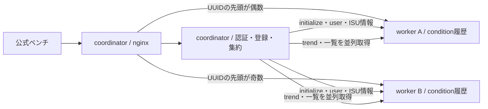
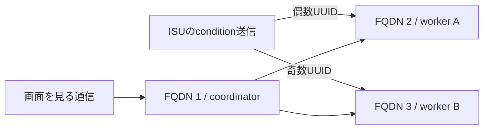
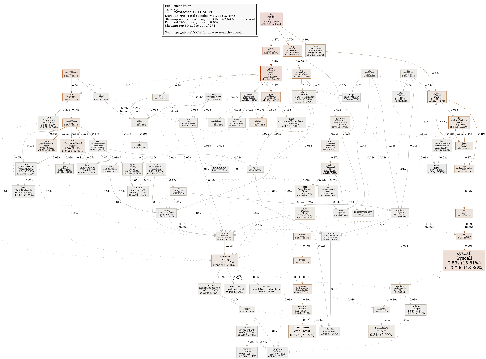
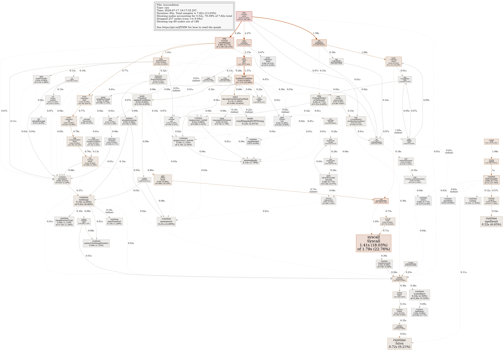

# 3台を「足す」のではなく、仕事を分けよう

1台で`57,208`点まで来ました。実競技ではサーバーを3台使えます。ここで2台増やせば、自動で3倍になるでしょうか。

残念ながら、起動しただけのサーバーは0点分の仕事しかしません。何をどこへ置き、どのデータを同期するかを決めます。

## 最初の役割分担

今回の構成は、1台をcoordinator、2台をworkerにしました。



coordinatorは、ログイン、ISU登録、利用者のISU一覧を担当します。condition履歴とgraphは、UUIDの先頭1文字を数値として見て、偶数ならworker A、奇数ならworker Bへ置きます。

UUIDはISUを区別する長いIDです。毎回同じ計算で同じworkerを選べるため、住所録を別に持たずに済みます。この分け方をsharding（シャーディング）と呼びます。

## 3台化直後、0点

最初のベンチは、準備段階で失敗しました。workerがcondition POSTへ401を返したためです。

初期データのuserは3台へ読み込んでいました。しかし、ベンチ中に新しくログインしたuserをcoordinatorのmemoryへ足しただけで、workerへ知らせていませんでした。

これはとてもよい失敗でした。分散構成で難しいのは、CPUを分けることより、**3つのmemoryが何を知っているべきか**だからです。

新規userを認証したとき、coordinatorから2台へ通知する経路を追加しました。初期化、user、ISU metadataについて、誰が正本を持ち、いつ配るかを表にします。

| データ        | 正本          | 同期する時点 | workerでの用途          |
| ------------- | ------------- | ------------ | ----------------------- |
| 初期データ    | DB            | initialize   | 全APIの開始状態         |
| user          | coordinator   | 認証成功直後 | conditionの所有確認     |
| ISU metadata  | coordinator   | 登録成功直後 | UUID・owner・character  |
| condition履歴 | owning worker | POSTのたび   | condition・graph・trend |

修正後は`70,064`点、deduction 0でpassしました。

## 入口も分ける

最初の3台構成では、すべての通信がcoordinatorのnginxへ入り、そこからworkerへ転送されます。Goの仕事は分かれても、TLSとnetworkの入口は1台のままです。

公式ベンチは`isucondition-1`から`isucondition-3`まで、3つのFQDNを別のIPへ対応させられます。FQDNは、`isucondition-2.t.isucon.dev`のような完全なホスト名です。

そこでISU登録時に、UUIDが偶数ならFQDN 2、奇数ならFQDN 3をJIAへ渡しました。JIAは最初から所有workerへconditionを送ります。



これで、1回分のTLS処理とproxy hopを減らせます。proxy hopは、別サーバーへ中継する1段分の移動です。

## pprofとvmstatを3台同時に見る

3台構成では、1台のpprofだけを見てはいけません。同じ60秒で3台分を取りました。





GoのCPU sampleは、main 5.25秒、worker A 7.82秒、worker B 7.77秒でした。workerの`fastPostCondition`はcum 1.57秒で、残りはHTTP read/writeやsyscallが目立ちます。

同じ時間のvmstatは、OS全体のCPU使用率を見せます。

| node                    |  user | system |  idle |
| ----------------------- | ----: | -----: | ----: |
| coordinator + benchmark | 60.7% |  16.7% | 22.7% |
| worker A                |  6.9% |   6.8% | 86.3% |
| worker B                |  6.9% |   6.3% | 86.8% |

workerはかなり暇なのに、coordinatorだけが忙しい。しかもGo profileではmainアプリのCPUは小さい。ここで、coordinatorに同居した**ベンチマーカー自身**がCPUを使っていると切り分けました。

AWS内の別nodeから測ると`73,604`点、3台をrebootしたあとの最終確認では`74,550`点でした。worker Aはベンチも兼務するので完全な外部測定ではありませんが、家庭回線を通さず、main同居より測定の偏りを減らせました。

## 3台化を頼むプロンプト

```text
最大3台を使った構成を設計し、実装・検証してください。

- 増設前のpprof、vmstat、access logから、分ける仕事を決める
- user、ISU metadata、condition履歴、sessionの正本を決める
- initializeとベンチ中の新規user・新規ISUをいつ同期するか表にする
- UUIDから常に同じworkerを選べるshardingを検討する
- browser通信とJIAのcondition POSTを、3つのFQDNへどう割り当てるか確認する
- internal APIはprivate IPとsecurity groupでVPC内だけに限定する
- まず1台追加で正しさを確かめ、必要なら3台にする
- 3台同時にpprofとvmstatを取得する
- worker停止、同期失敗、initialize再実行でどうなるか確認する
- pass、deduction 0、HTTP 5xx 0を満たすまで最高scoreとして扱わない

構成図、同期表、失敗時の戻し方を作ってから実装してください。
```

サーバー台数は、強さではなく設計の選択肢です。「余った2台に何を置く？」と考え始めたとき、初めて3台分の力が出ます。
